# Core Package Integration Architecture - External Systems

## Architecture Overview

**Purpose**: Documents the complete integration architecture of the BigCommerce Core Package with external systems and services.

**Architecture**: Multi-layered integration architecture with external services, payment providers, analytics, and extension systems.

## Integration Layers

### 1. BigCommerce SDK Integration

#### CheckoutApp Integration
**Purpose**: Main checkout application integration
**Architecture**: Service-based integration with React state management
**Source Code**: `packages/core/src/app/checkout/CheckoutApp.tsx`

#### OrderConfirmationApp Integration
**Purpose**: Order confirmation application integration
**Architecture**: Service-based integration with React state management
**Source Code**: `packages/core/src/app/order/OrderConfirmationApp.tsx`

#### SDK Service Architecture
**Purpose**: Core integration with BigCommerce checkout functionality
**Architecture**: Service-based integration with React state management
**Source Code**: `packages/core/src/app/checkout/withCheckout.tsx`

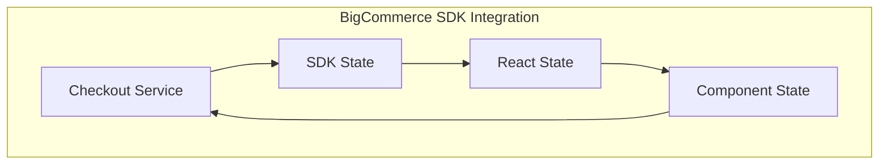

#### SDK Integration Features
- **Checkout Management**: Checkout creation and management
- **Cart Operations**: Cart manipulation and updates
- **Customer Management**: Customer authentication and profiles
- **Payment Processing**: Payment method handling
- **Order Management**: Order creation and processing
- **Shipping Management**: Shipping address and method handling
- **Order Confirmation**: Order confirmation and completion
- **Guest Account Creation**: Guest account creation and management
- **Embedded Checkout**: Embedded checkout support

### 2. Payment Provider Integration

#### Payment Integration Architecture
**Purpose**: Integration with various payment providers
**Architecture**: Plugin-based payment integration system
**Source Code**: `packages/core/src/app/payment/`

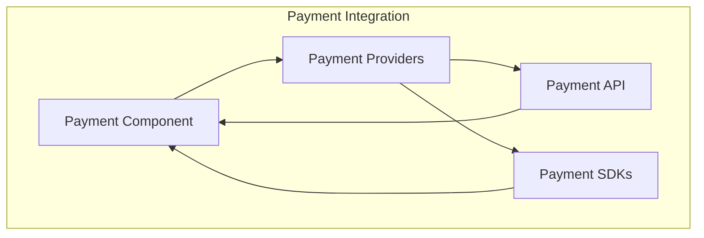

#### Supported Payment Providers (30+ integrations)
- **Stripe**: Stripe payment integration
- **PayPal Commerce**: PayPal Commerce integration
- **PayPal Express**: PayPal Express integration
- **PayPal Fastlane**: PayPal Fastlane integration
- **Braintree**: Braintree payment integration
- **Amazon Pay V2**: Amazon Pay V2 integration
- **Apple Pay**: Apple Pay integration
- **Google Pay**: Google Pay integration
- **Adyen**: Adyen payment integration
- **Klarna**: Klarna payment integration
- **Afterpay**: Afterpay payment integration
- **Affirm**: Affirm payment integration
- **Bolt**: Bolt payment integration
- **Checkout.com**: Checkout.com integration
- **Clearpay**: Clearpay payment integration
- **Mollie**: Mollie payment integration
- **Moneris**: Moneris payment integration
- **Square V2**: Square V2 integration
- **BlueSnap Direct**: BlueSnap Direct integration
- **Barclay**: Barclay payment integration
- **BigCommerce Payments**: BigCommerce Payments integration
- **BigCommerce Payments Utils**: BigCommerce Payments utilities
- **Credit Card**: Credit card integration
- **Hosted Credit Card**: Hosted credit card integration
- **Hosted Drop-in**: Hosted drop-in integration
- **Hosted Field**: Hosted field integration
- **Hosted Payment**: Hosted payment integration
- **Hosted Widget**: Hosted widget integration
- **Offline Payment**: Offline payment integration
- **TD Bank**: TD Bank integration
- **Worldpay Access**: Worldpay Access integration
- **Wallet Button**: Wallet button integration

### 3. Analytics Integration

#### Analytics Service Architecture
**Purpose**: User behavior tracking and analytics
**Architecture**: HOC-based analytics integration
**Source Code**: `packages/core/src/app/analytics/`

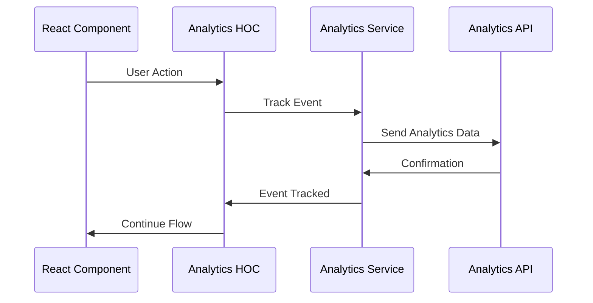

#### Analytics Integration Features
- **Event Tracking**: User interaction tracking
- **Page Views**: Page view tracking
- **Conversion Tracking**: Conversion event tracking
- **Error Tracking**: Error event tracking
- **Performance Tracking**: Performance metrics tracking

### 4. Extension System Integration

#### Extension Architecture
**Purpose**: Third-party extension support
**Architecture**: Plugin-based extension system
**Source Code**: `packages/checkout-extension/` and `packages/core/src/app/checkout/CheckoutApp.tsx`

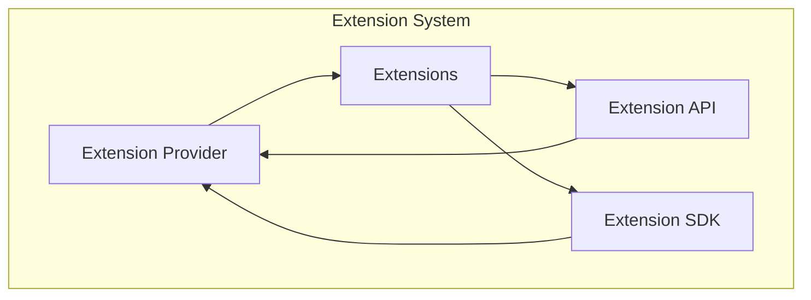

#### Extension Integration Features
- **Extension Loading**: Dynamic extension loading
- **Extension Communication**: Extension-to-app communication
- **Extension Lifecycle**: Extension lifecycle management
- **Extension Security**: Extension security and validation
- **Extension API**: Extension API and interfaces
- **Extension Context**: Extension context providers
- **Extension Types**: Extension type definitions

### 5. Internationalization Integration

#### Locale Service Architecture
**Purpose**: Multi-language support and localization
**Architecture**: Service-based localization system
**Source Code**: `packages/locale/` and `packages/core/src/app/checkout/CheckoutApp.tsx`

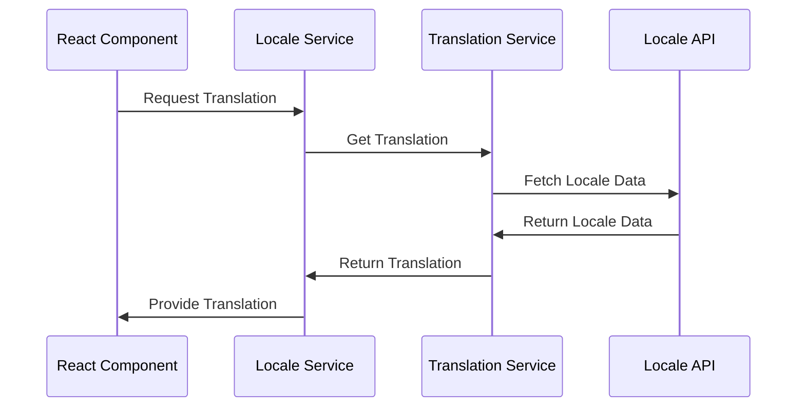

#### Locale Integration Features
- **Language Detection**: Automatic language detection
- **Translation Management**: Dynamic translation loading
- **Locale Formatting**: Number and date formatting
- **RTL Support**: Right-to-left language support
- **Multi-language Support**: Support for multiple languages
- **Translation Keys**: Translation key management
- **Locale Context**: Locale context providers

## Additional Integration Packages

### 1. Utility Package Integration

#### Utility Package Architecture
**Purpose**: Core utility functions and shared functionality
**Architecture**: Utility package system with shared modules
**Source Code**: `packages/utility/`, `packages/dom-utils/`, `packages/error-handling-utils/`, `packages/instrument-utils/`

#### Utility Integration Features
- **DOM Utilities**: DOM manipulation and utilities
- **Error Handling**: Error handling utilities and logging
- **Instrument Utils**: Payment instrument utilities
- **General Utilities**: Common utility functions

### 2. Legacy HOC Integration

#### Legacy HOC Architecture
**Purpose**: Legacy Higher-Order Component support
**Architecture**: HOC-based component enhancement
**Source Code**: `packages/legacy-hoc/`

#### Legacy HOC Features
- **HOC Creation**: Higher-Order Component creation utilities
- **Context Injection**: Context injection patterns
- **Component Enhancement**: Component enhancement utilities

### 3. Payment Integration API

#### Payment Integration API Architecture
**Purpose**: Payment integration API and interfaces
**Architecture**: API-based payment integration system
**Source Code**: `packages/payment-integration-api/`

#### Payment Integration API Features
- **Payment Interfaces**: Payment method interfaces
- **Integration APIs**: Payment integration APIs
- **Context Providers**: Payment context providers
- **Type Definitions**: Payment type definitions

### 4. Workspace Tools Integration

#### Workspace Tools Architecture
**Purpose**: Development workspace tools and utilities
**Architecture**: Tool-based development system
**Source Code**: `packages/workspace-tools/`

#### Workspace Tools Features
- **Build Tools**: Build system utilities
- **Development Tools**: Development environment tools
- **Testing Tools**: Testing utilities and helpers
- **Linting Tools**: Code quality and linting tools

## External Service Integration

### 1. API Integration

#### REST API Integration
**Purpose**: HTTP API integration with external services
**Architecture**: Service-based API integration
**Key Features**:
- **HTTP Client**: HTTP request/response handling
- **Authentication**: API authentication and authorization
- **Error Handling**: API error handling and recovery
- **Caching**: API response caching

#### API Integration Flow
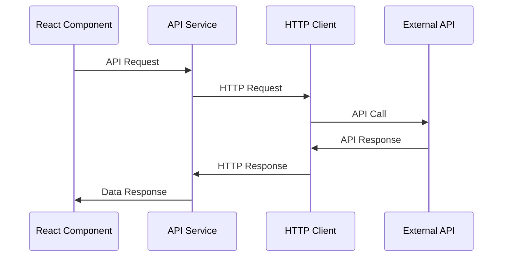

### 2. WebSocket Integration

#### Real-time Communication
**Purpose**: Real-time data synchronization
**Architecture**: WebSocket-based real-time communication
**Key Features**:
- **Connection Management**: WebSocket connection handling
- **Message Handling**: Real-time message processing
- **Reconnection**: Automatic reconnection logic
- **Error Handling**: WebSocket error handling

#### WebSocket Integration Flow
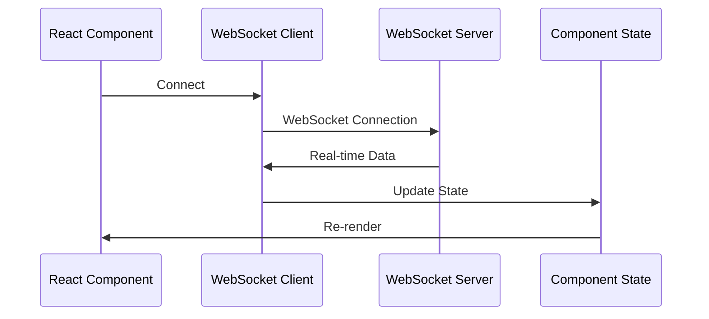

### 3. Third-party Service Integration

#### External Service Architecture
**Purpose**: Integration with external third-party services
**Architecture**: Service-based external integration
**Key Services**:
- **Analytics Services**: Google Analytics, Adobe Analytics
- **Payment Services**: Stripe, PayPal, Braintree
- **Shipping Services**: Shipping provider APIs
- **Marketing Services**: Marketing automation services

#### Service Integration Flow
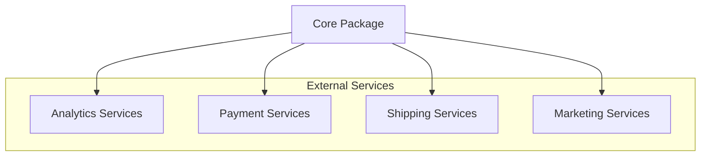

## Integration Patterns

### 1. Service Integration Pattern

#### Service Architecture
**Purpose**: Standardized service integration pattern
**Architecture**: Service-based integration with dependency injection
**Key Components**:
- **Service Interface**: Standardized service interface
- **Service Implementation**: Service implementation
- **Service Factory**: Service creation and management
- **Service Registry**: Service registration and discovery

#### Service Integration Flow
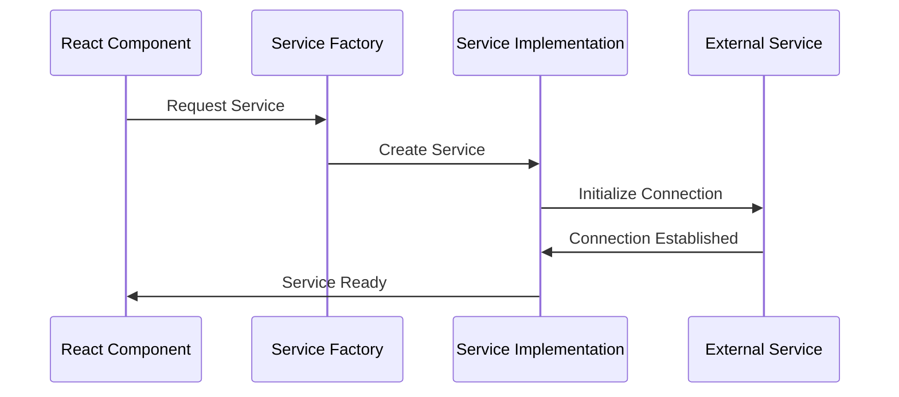

### 2. Plugin Integration Pattern

#### Plugin Architecture
**Purpose**: Plugin-based integration system
**Architecture**: Plugin system with dynamic loading
**Key Components**:
- **Plugin Interface**: Standardized plugin interface
- **Plugin Loader**: Dynamic plugin loading
- **Plugin Registry**: Plugin registration and management
- **Plugin Lifecycle**: Plugin lifecycle management

#### Plugin Integration Flow
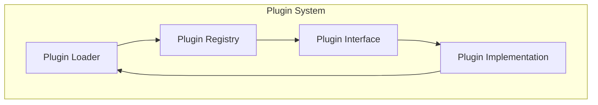

### 3. Event Integration Pattern

#### Event Architecture
**Purpose**: Event-driven integration system
**Architecture**: Event-based communication system
**Key Components**:
- **Event Emitter**: Event emission system
- **Event Listener**: Event listening system
- **Event Bus**: Event routing system
- **Event Handler**: Event processing system

#### Event Integration Flow
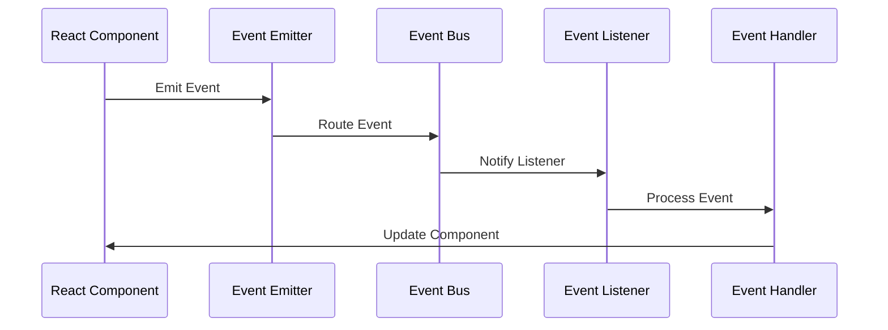

## Security Integration

### 1. Authentication Integration

#### Authentication Architecture
**Purpose**: Secure authentication and authorization
**Architecture**: Token-based authentication system
**Key Features**:
- **Token Management**: JWT token handling
- **Session Management**: User session management
- **Permission Checking**: Role-based access control
- **Security Headers**: Security header management

#### Authentication Flow
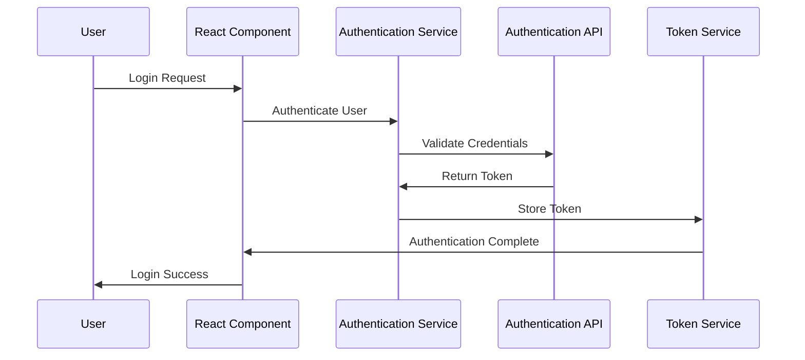

### 2. Data Security Integration

#### Security Architecture
**Purpose**: Data security and protection
**Architecture**: Multi-layered security system
**Key Features**:
- **Data Encryption**: Data encryption in transit and at rest
- **Input Validation**: Input sanitization and validation
- **XSS Prevention**: Cross-site scripting prevention
- **CSRF Protection**: Cross-site request forgery protection

#### Security Integration Flow
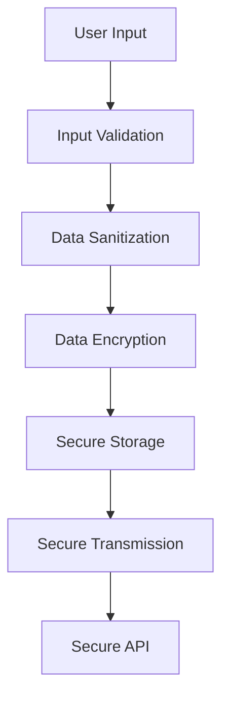

## Performance Integration

### 1. Caching Integration

#### Caching Architecture
**Purpose**: Performance optimization through caching
**Architecture**: Multi-level caching system
**Key Features**:
- **Component Caching**: React component caching
- **Data Caching**: API response caching
- **Bundle Caching**: Webpack bundle caching
- **CDN Caching**: Content delivery network caching

#### Caching Integration Flow
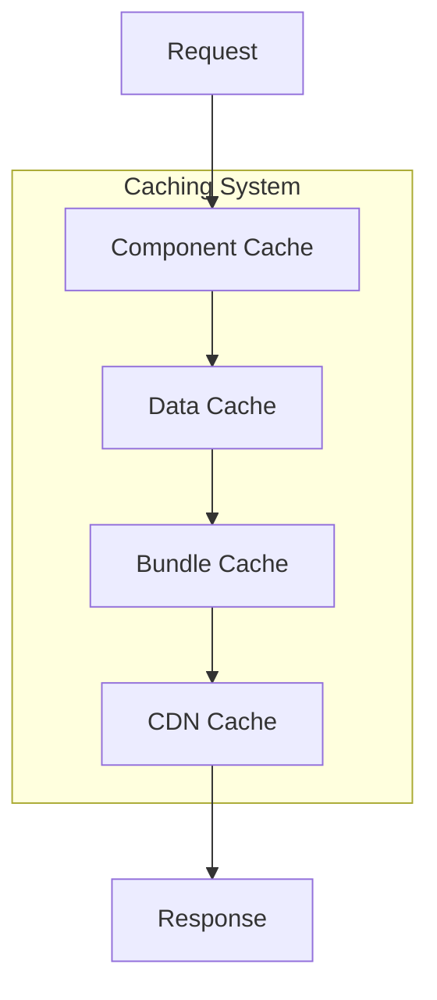

### 2. Performance Monitoring Integration

#### Monitoring Architecture
**Purpose**: Performance monitoring and optimization
**Architecture**: Service-based monitoring system
**Key Features**:
- **Performance Metrics**: Performance data collection
- **Error Monitoring**: Error tracking and monitoring
- **User Analytics**: User behavior analytics
- **Business Metrics**: Business KPI tracking

#### Monitoring Integration Flow
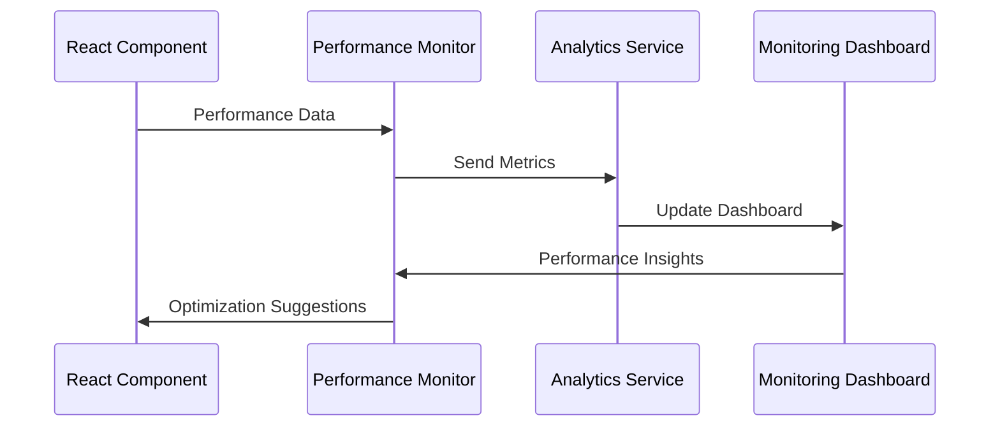

## Testing Integration

### 1. Integration Testing

#### Testing Architecture
**Purpose**: Comprehensive integration testing
**Architecture**: Multi-level testing system
**Key Features**:
- **Unit Testing**: Individual component testing
- **Integration Testing**: Cross-component testing
- **E2E Testing**: End-to-end testing
- **Performance Testing**: Performance validation

#### Testing Integration Flow
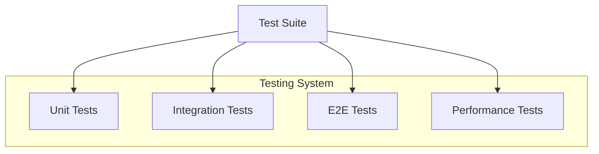

### 2. Mock Integration

#### Mock Architecture
**Purpose**: Mock external services for testing
**Architecture**: Service-based mocking system
**Key Features**:
- **API Mocking**: External API mocking
- **Service Mocking**: External service mocking
- **Data Mocking**: Test data generation
- **Behavior Mocking**: Service behavior mocking

#### Mock Integration Flow
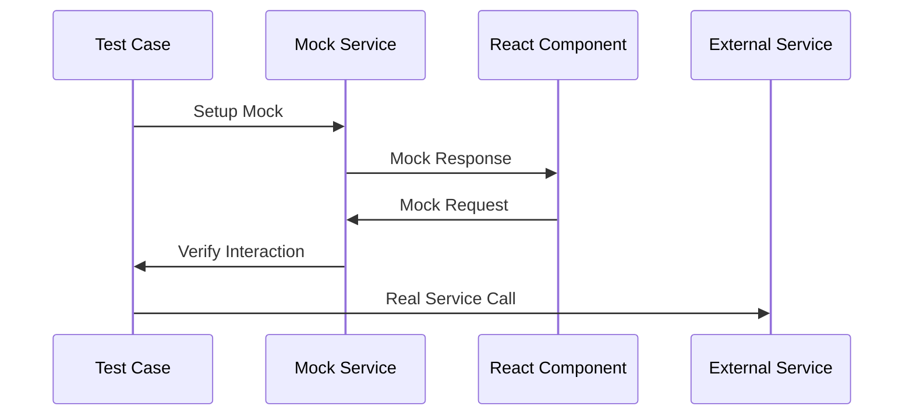

## Deployment Integration

### 1. Build Integration

#### Build Architecture
**Purpose**: Build system integration
**Architecture**: Webpack-based build system
**Key Features**:
- **Module Bundling**: JavaScript module bundling
- **Asset Optimization**: Asset optimization and compression
- **Code Splitting**: Dynamic code splitting
- **Environment Configuration**: Environment-specific builds

#### Build Integration Flow
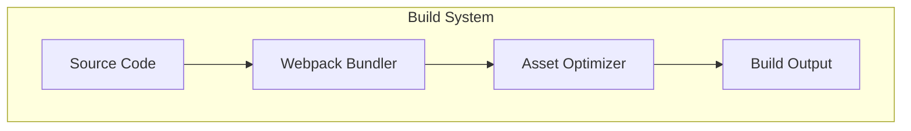

### 2. Deployment Integration

#### Deployment Architecture
**Purpose**: Application deployment and distribution
**Architecture**: Multi-environment deployment system
**Key Features**:
- **Environment Management**: Multi-environment support
- **Asset Distribution**: Asset distribution and CDN integration
- **Version Management**: Application versioning
- **Rollback Support**: Deployment rollback capabilities

#### Deployment Integration Flow
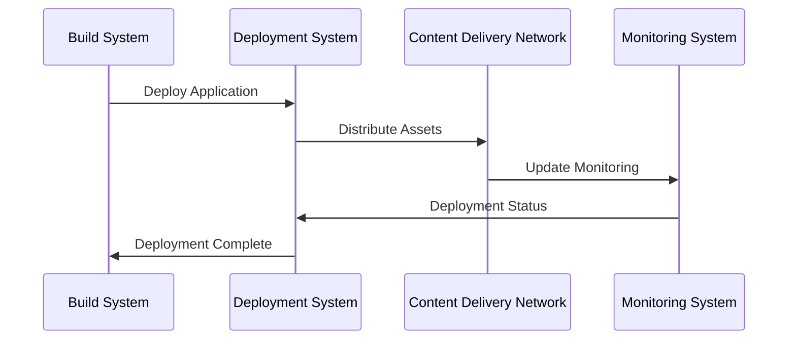
