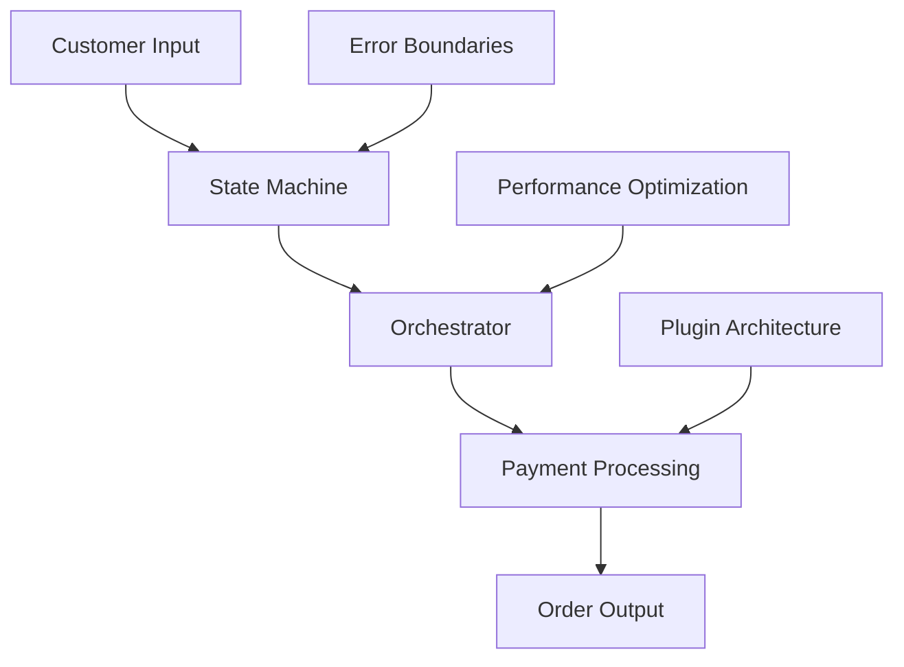
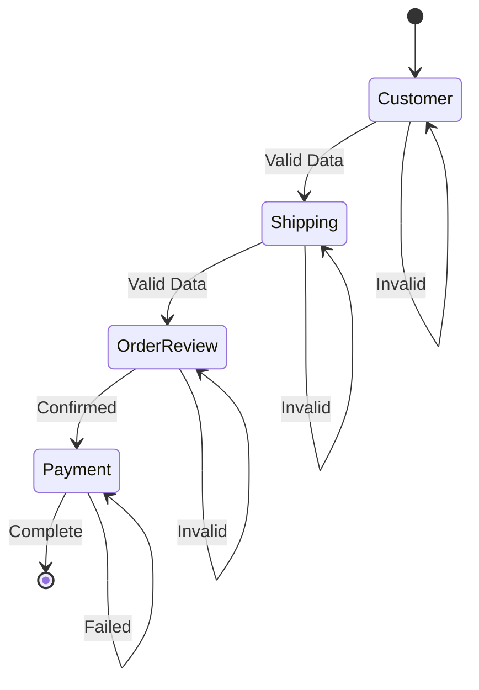
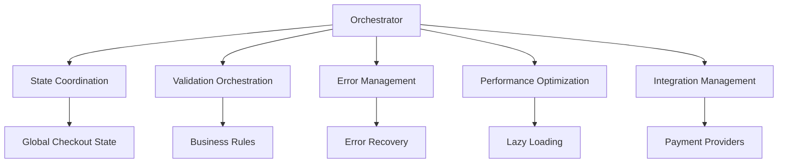
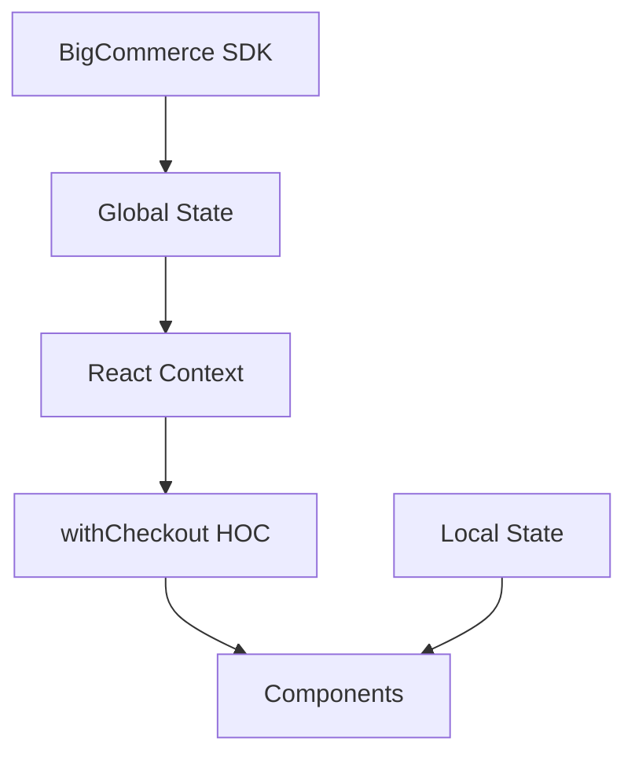
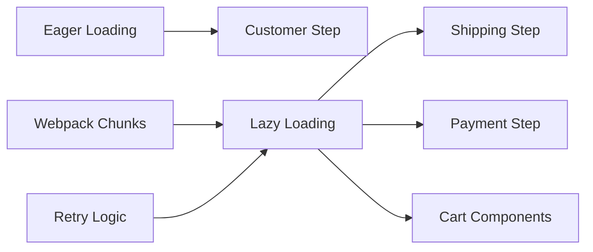
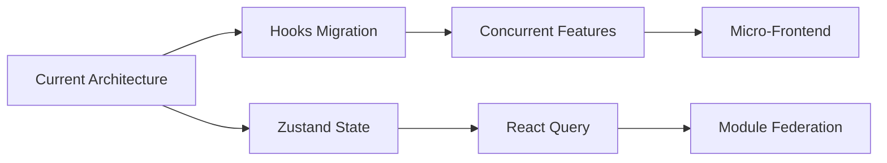

# Checkout Flow Architecture

## System Overview

**Purpose**: Stateful, multi-step checkout orchestration system for high-conversion e-commerce transactions with extensible payment processing.

**Pattern**: Step-Based State Machine with Orchestrator Pattern and Context-Driven State Management

**Boundaries**: 
- Input: Customer data, cart contents, payment methods
- Output: Completed orders, payment confirmations  
- Dependencies: BigCommerce SDK, payment processors, analytics services

## Core Architecture

### State Machine Pattern

### Orchestrator Pattern

**Design**: Centralized orchestration for state transitions and cross-cutting concerns
**Benefits**: Single responsibility, consistency, maintainability, testability

### Context-Driven State Management

**Design**: React Context + HOC pattern for state distribution
**Benefits**: Performance, flexibility, maintainability, testing

### Performance Architecture

**Design**: Code splitting with dynamic imports
**Benefits**: Faster initial load, progressive loading, better caching, scalability

## Architecture Decisions

### State Management: Context vs Redux
| Aspect | Decision | Rationale | Trade-off |
|--------|----------|-----------|-----------|
| **Pattern** | React Context + HOC | Simpler, better BigCommerce integration | Less debugging tools than Redux |
| **Performance** | Context prevents re-renders | Better performance for this use case | May become complex with large state |
| **Testing** | Context testing setup | Easier to understand and debug | More setup than Redux testing |

### Components: Class vs Functional
| Aspect | Decision | Rationale | Trade-off |
|--------|----------|-----------|-----------|
| **Pattern** | Class Components | Complex lifecycle management needed | Not using modern React hooks |
| **Performance** | shouldComponentUpdate | Fine-grained optimization control | Slightly larger bundle size |
| **Integration** | BigCommerce patterns | Better integration with existing code | More verbose than functional |

### Performance: Lazy vs Eager Loading
| Aspect | Decision | Rationale | Trade-off |
|--------|----------|-----------|-----------|
| **Strategy** | Lazy Loading | Faster initial load, better caching | More complex loading logic |
| **User Experience** | Progressive loading | Better perceived performance | Multiple HTTP requests |
| **Scalability** | Code splitting | New features don't impact bundle | Harder to debug lazy components |

## System Quality Matrix

| Attribute | Strategy | Implementation | Benefit |
|-----------|----------|----------------|---------|
| **Performance** | Lazy Loading | Code splitting, webpack chunks | Faster initial load |
| **Scalability** | Plugin Architecture | HOC composition, extensions | New providers without core changes |
| **Security** | Input Validation | Yup schemas, DOMPurify | XSS prevention, PCI compliance |
| **Resilience** | Error Boundaries | Centralized error handling | Graceful degradation |
| **Maintainability** | Modular Design | Clear separation of concerns | Independent development |

## Future Evolution Path

**Current Strengths**: State machine, orchestrator, plugin architecture, error boundaries, lazy loading

**Modern React Evolution**: Hooks migration, Suspense integration, concurrent features

**State Management Evolution**: Zustand integration, React Query for server state, optimistic updates

**Micro-Frontend Architecture**: Module Federation, independent deployments, shared libraries

**Performance Monitoring**: Real user monitoring, bundle analysis, Core Web Vitals tracking

## Conclusion

**Architecture**: Mature, production-ready system built on solid principles

**Key Achievements**: State machine pattern, orchestrator coordination, plugin architecture, performance optimization, error resilience

**System Quality**: Maintainable, scalable, performant, secure

**Future**: Solid foundation for evolution toward modern React patterns while maintaining production stability