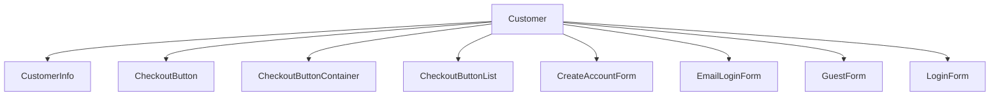
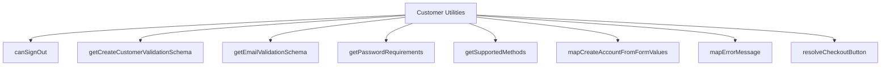

# Customer Component - Shared Core Package

## Component Overview

**Purpose**: Shared customer management functionality used by both checkout and order confirmation flows for customer authentication, account management, and profile handling.

**Architecture**: Multi-component system with authentication, account creation, and profile management.

**Source Code**: `packages/core/src/app/customer/`

## Key Responsibilities

### 1. Customer Authentication
- **Login Management**: Handles customer login and authentication
- **Session Management**: Manages customer sessions and tokens
- **Authentication State**: Tracks authentication status and user data
- **Logout Management**: Handles customer logout and session cleanup

### 2. Account Management
- **Account Creation**: Handles new customer account creation
- **Profile Management**: Manages customer profile information
- **Account Validation**: Validates account creation requirements
- **Password Management**: Handles password creation and validation

### 3. Guest Management
- **Guest Flow**: Manages guest checkout flow
- **Guest Account Creation**: Handles guest account creation after order
- **Guest Validation**: Validates guest account requirements
- **Guest Conversion**: Converts guest accounts to full accounts

## Component Structure





## State Management

### CustomerState Interface
```typescript
export interface CustomerState {
    isGuest: boolean;
    isSignedIn: boolean;
    customer?: Customer;
    error?: Error;
    isSigningIn: boolean;
    isSigningUp: boolean;
}
```

### Key State Properties
- **Authentication State**: Customer authentication status
- **User Data**: Customer profile and account information
- **Form State**: Customer form data and validation state
- **Error State**: Customer authentication and account creation errors

## Integration Points

### Checkout Flow Integration
- **Customer Step**: Handles customer authentication in checkout
- **Account Creation**: Creates customer accounts during checkout
- **Guest Flow**: Manages guest checkout flow
- **Authentication**: Handles customer authentication during checkout

### Order Confirmation Flow Integration
- **Guest Account Creation**: Creates guest accounts after order completion
- **Account Validation**: Validates guest account creation
- **Profile Display**: Displays customer profile in confirmation
- **Account Management**: Manages customer account after order

### Shared Utilities
- **Authentication**: Customer authentication utilities
- **Account Management**: Customer account management utilities
- **Validation**: Customer validation utilities
- **Form Management**: Customer form management utilities

## Key Features

### 1. Authentication Management
- **Login Forms**: Customer login form handling
- **Session Management**: Customer session management
- **Authentication State**: Authentication status tracking
- **Logout Management**: Customer logout handling

### 2. Account Creation
- **Account Forms**: Customer account creation forms
- **Validation**: Account creation validation
- **Password Management**: Password creation and validation
- **Profile Creation**: Customer profile creation

### 3. Guest Management
- **Guest Forms**: Guest checkout forms
- **Guest Validation**: Guest account validation
- **Guest Conversion**: Guest to customer conversion
- **Guest Account Creation**: Guest account creation after order

## Performance Considerations

### 1. Lazy Loading
- **Authentication**: Authentication component lazy loading
- **Account Forms**: Account form lazy loading
- **Guest Forms**: Guest form lazy loading

### 2. Caching
- **Customer Data**: Customer data caching
- **Authentication State**: Authentication state caching
- **Form Data**: Form data caching

### 3. Optimization
- **Authentication Performance**: Authentication performance optimization
- **Form Performance**: Form rendering performance optimization
- **Validation Performance**: Validation performance optimization

## Security Considerations

### 1. Authentication Security
- **Password Security**: Password security and validation
- **Session Security**: Session security and management
- **Authentication Security**: Authentication security measures

### 2. Data Protection
- **Customer Privacy**: Customer data privacy protection
- **Account Privacy**: Account data privacy protection
- **Form Privacy**: Form data privacy protection

## Testing Strategy

### 1. Unit Tests
- **Component Tests**: Individual component testing
- **Utility Tests**: Customer utility function testing
- **Authentication Tests**: Authentication testing
- **Validation Tests**: Customer validation testing

### 2. Integration Tests
- **Authentication Integration**: Authentication integration testing
- **Account Integration**: Account management integration testing
- **Guest Integration**: Guest flow integration testing

### 3. E2E Tests
- **Authentication Flow**: Complete authentication flow testing
- **Account Creation Flow**: Account creation flow testing
- **Guest Flow**: Guest checkout flow testing

## Common Issues

### 1. Authentication Issues
- **Login Failures**: Customer login failures
- **Session Issues**: Session management issues
- **Authentication State**: Authentication state issues

### 2. Account Issues
- **Account Creation**: Account creation issues
- **Validation Issues**: Account validation issues
- **Profile Issues**: Customer profile issues

### 3. Guest Issues
- **Guest Flow**: Guest checkout flow issues
- **Guest Validation**: Guest validation issues
- **Guest Conversion**: Guest to customer conversion issues

## Future Considerations

### 1. Enhanced Features
- **Social Login**: Social media login integration
- **Two-Factor Authentication**: Two-factor authentication support
- **Account Recovery**: Enhanced account recovery functionality

### 2. Integration Improvements
- **Authentication Integration**: Enhanced authentication integration
- **Account Integration**: Improved account management integration
- **Guest Integration**: Enhanced guest flow integration

### 3. Performance Optimizations
- **Authentication Performance**: Authentication performance optimization
- **Account Performance**: Account management performance optimization
- **Guest Performance**: Guest flow performance optimization
