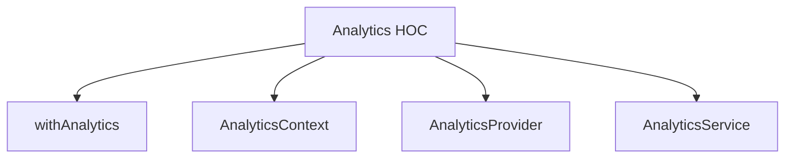
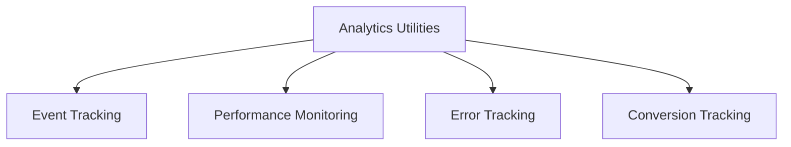

# Analytics Component - Shared Core Package

## Component Overview

**Purpose**: Shared analytics functionality used by both checkout and order confirmation flows for user behavior tracking, event monitoring, and performance analytics.

**Architecture**: HOC-based analytics integration with event tracking and performance monitoring.

**Source Code**: `packages/core/src/app/analytics/`

## Key Responsibilities

### 1. Event Tracking
- **User Interactions**: Tracks user interactions and behaviors
- **Page Views**: Monitors page views and navigation
- **Conversion Events**: Tracks conversion and completion events
- **Error Events**: Monitors errors and exceptions

### 2. Performance Monitoring
- **Performance Metrics**: Tracks performance metrics and timing
- **Load Times**: Monitors page and component load times
- **User Experience**: Tracks user experience metrics
- **Business Metrics**: Monitors business KPIs and metrics

### 3. Analytics Integration
- **Analytics Services**: Integrates with various analytics services
- **Event Processing**: Processes and sends analytics events
- **Data Collection**: Collects and aggregates analytics data
- **Reporting**: Provides analytics reporting and insights

## Component Structure





## State Management

### AnalyticsState Interface
```typescript
export interface AnalyticsState {
    events: AnalyticsEvent[];
    performance: PerformanceMetrics;
    errors: ErrorEvent[];
    conversions: ConversionEvent[];
}
```

### Key State Properties
- **Event Data**: Analytics event data and tracking
- **Performance Data**: Performance metrics and timing
- **Error Data**: Error events and exceptions
- **Conversion Data**: Conversion events and completion

## Integration Points

### Checkout Flow Integration
- **Checkout Events**: Tracks checkout flow events
- **Step Progression**: Monitors step progression and completion
- **Payment Events**: Tracks payment-related events
- **Conversion Events**: Monitors checkout completion and conversion

### Order Confirmation Flow Integration
- **Confirmation Events**: Tracks order confirmation events
- **Completion Events**: Monitors order completion events
- **Account Events**: Tracks account creation events
- **Success Events**: Monitors success and completion events

### Shared Utilities
- **Event Tracking**: Analytics event tracking utilities
- **Performance Monitoring**: Performance monitoring utilities
- **Error Tracking**: Error tracking utilities
- **Conversion Tracking**: Conversion tracking utilities

## Key Features

### 1. Event Tracking
- **User Interactions**: Tracks user clicks, form submissions, and interactions
- **Page Views**: Monitors page views and navigation patterns
- **Custom Events**: Tracks custom business events
- **Error Events**: Monitors errors and exceptions

### 2. Performance Monitoring
- **Load Times**: Tracks page and component load times
- **Render Times**: Monitors component render times
- **API Calls**: Tracks API call performance
- **User Experience**: Monitors user experience metrics

### 3. Analytics Integration
- **Multiple Services**: Integrates with various analytics services
- **Event Processing**: Processes and sends analytics events
- **Data Aggregation**: Aggregates analytics data
- **Reporting**: Provides analytics reporting and insights

## Performance Considerations

### 1. Lazy Loading
- **Analytics Services**: Analytics service lazy loading
- **Event Processing**: Event processing lazy loading
- **Performance Monitoring**: Performance monitoring lazy loading

### 2. Caching
- **Event Data**: Analytics event data caching
- **Performance Data**: Performance data caching
- **Error Data**: Error data caching

### 3. Optimization
- **Event Optimization**: Analytics event optimization
- **Performance Optimization**: Performance monitoring optimization
- **Data Optimization**: Analytics data optimization

## Security Considerations

### 1. Data Privacy
- **User Privacy**: User data privacy protection
- **Event Privacy**: Analytics event privacy protection
- **Performance Privacy**: Performance data privacy protection

### 2. Data Security
- **Data Encryption**: Analytics data encryption
- **Secure Transmission**: Secure analytics data transmission
- **Data Validation**: Analytics data validation

## Testing Strategy

### 1. Unit Tests
- **Component Tests**: Individual component testing
- **Utility Tests**: Analytics utility function testing
- **Event Tests**: Analytics event testing
- **Performance Tests**: Performance monitoring testing

### 2. Integration Tests
- **Analytics Integration**: Analytics integration testing
- **Event Integration**: Event tracking integration testing
- **Performance Integration**: Performance monitoring integration testing

### 3. E2E Tests
- **Analytics Flow**: Complete analytics flow testing
- **Event Flow**: Event tracking flow testing
- **Performance Flow**: Performance monitoring flow testing

## Common Issues

### 1. Tracking Issues
- **Event Loss**: Analytics event loss issues
- **Performance Issues**: Performance monitoring issues
- **Data Issues**: Analytics data issues

### 2. Integration Issues
- **Service Integration**: Analytics service integration issues
- **Event Processing**: Event processing issues
- **Data Collection**: Data collection issues

### 3. Performance Issues
- **Analytics Performance**: Analytics performance issues
- **Event Performance**: Event tracking performance issues
- **Monitoring Performance**: Performance monitoring issues

## Future Considerations

### 1. Enhanced Features
- **Real-time Analytics**: Real-time analytics functionality
- **Advanced Tracking**: Advanced event tracking
- **Machine Learning**: Machine learning analytics integration

### 2. Integration Improvements
- **Analytics Integration**: Enhanced analytics integration
- **Event Integration**: Improved event tracking integration
- **Performance Integration**: Enhanced performance monitoring integration

### 3. Performance Optimizations
- **Analytics Performance**: Analytics performance optimization
- **Event Performance**: Event tracking performance optimization
- **Monitoring Performance**: Performance monitoring optimization
