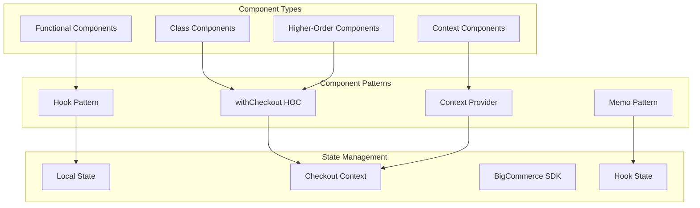
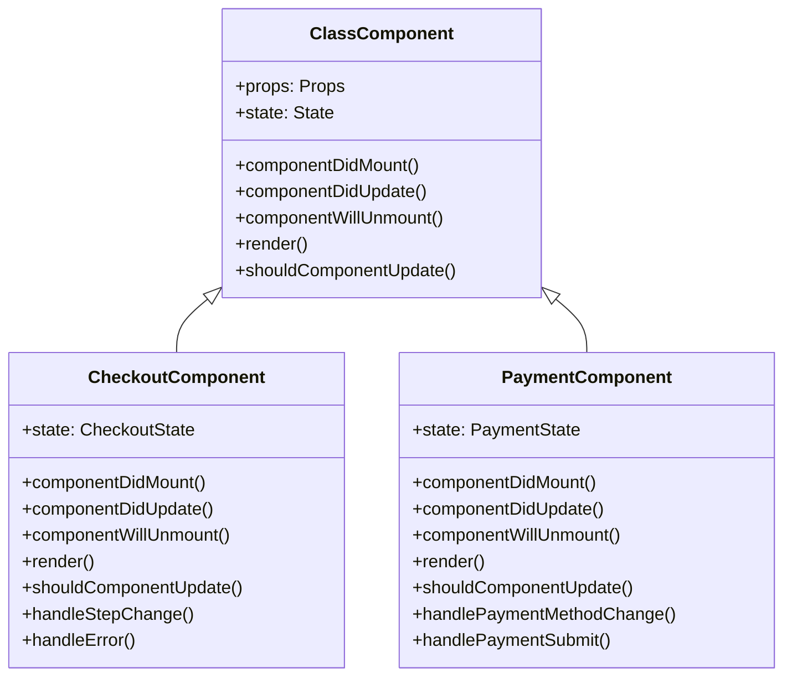
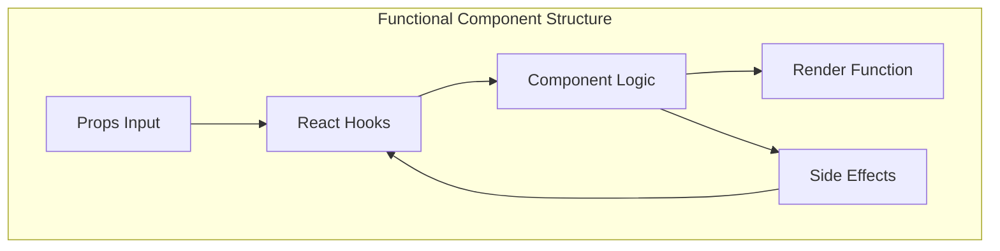
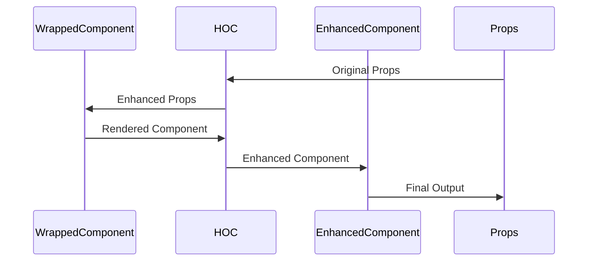
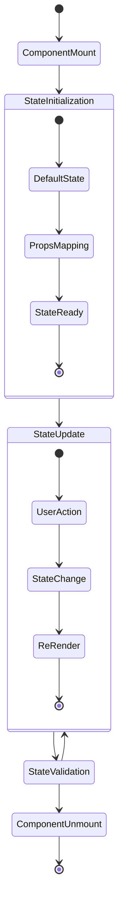
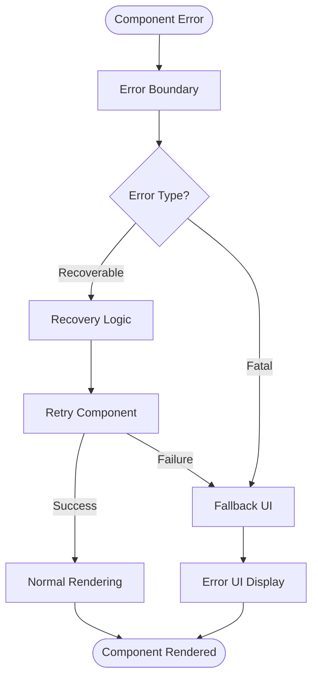
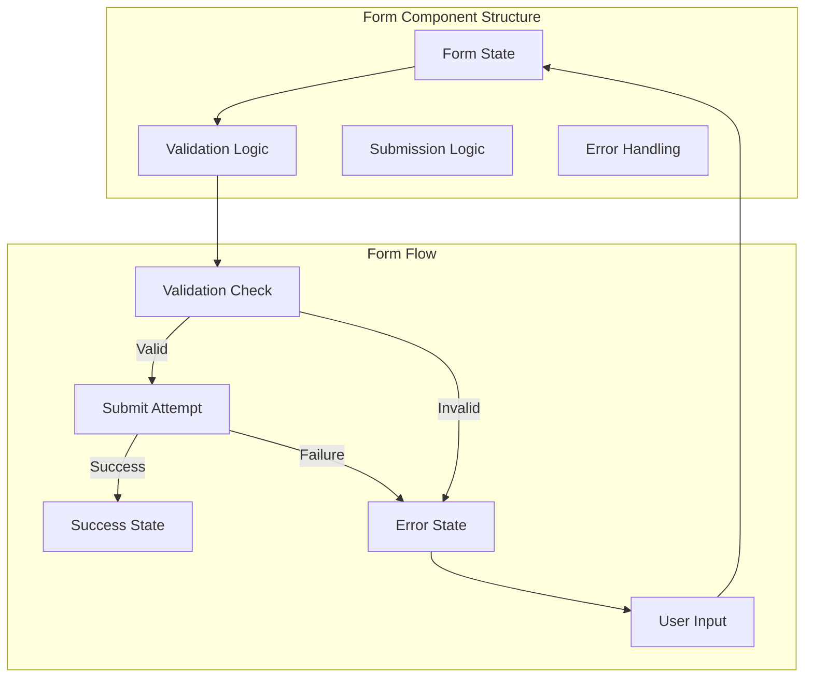
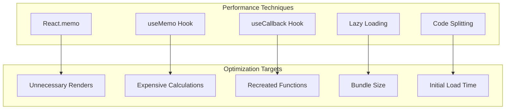
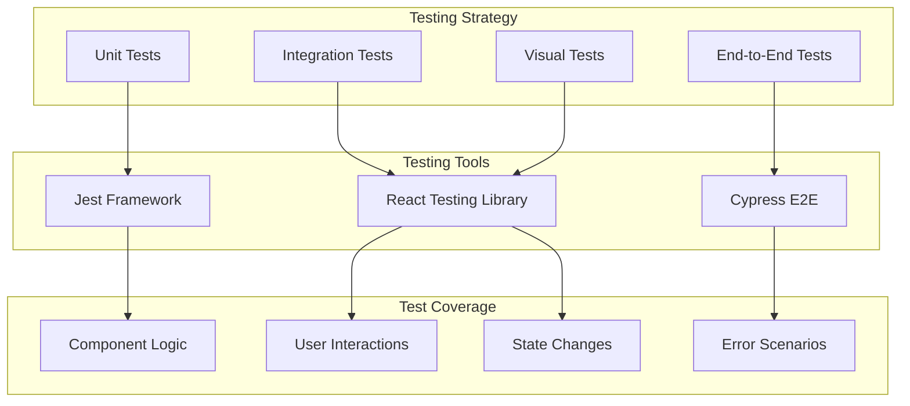

# Component Patterns - System Patterns

## Architecture Overview

**Purpose**: Documents component patterns, practices, and strategies used across all packages in the BigCommerce checkout system.

**Architecture**: System-level documentation of component patterns, practices, and component strategies.

## Component Architecture Diagram

## Class Component Pattern

## Functional Component Pattern

## Higher-Order Component Pattern

## State Management Patterns

## Error Boundary Pattern

## Form Component Pattern

## Performance Optimization Patterns

## Testing Patterns

## Maintenance Notes

### Common Issues
- **Component Complexity**: Managing component complexity and maintainability
- **Performance Issues**: Optimizing component performance
- **State Management**: Managing component state effectively
- **Testing Coverage**: Ensuring adequate component test coverage

### Future Considerations
- **New Patterns**: Adopting new component patterns
- **Enhanced Performance**: Improved component performance optimization
- **Better Testing**: Enhanced component testing strategies
- **Best Practices**: Continued component best practices evolution
