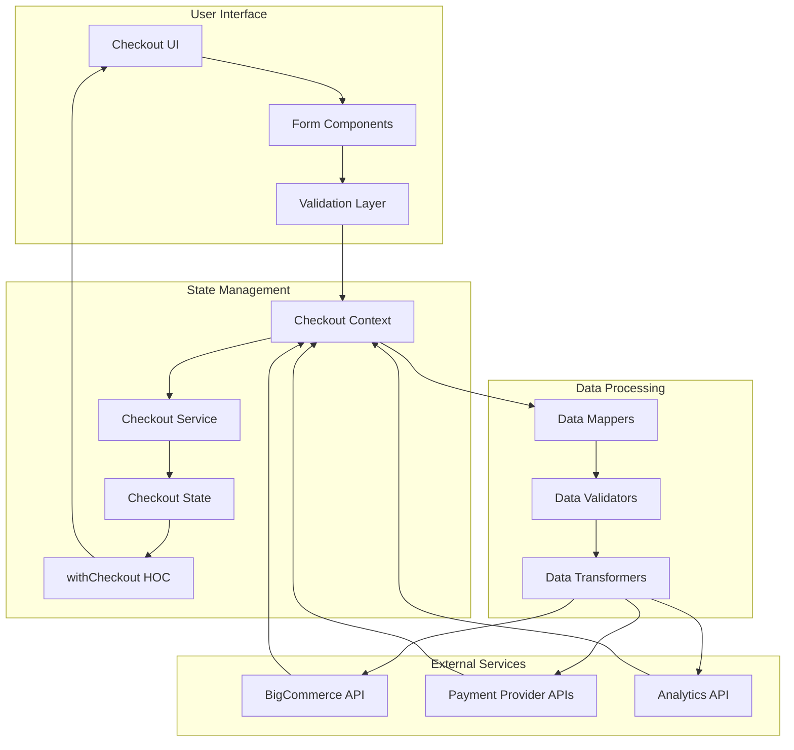
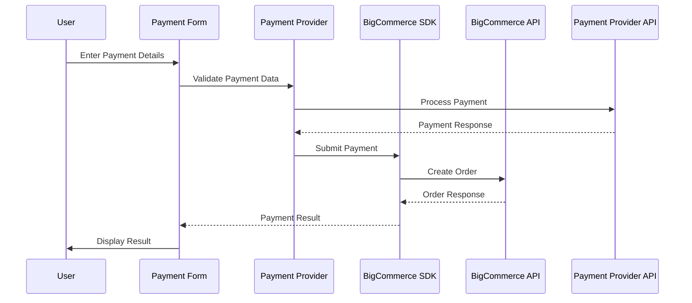
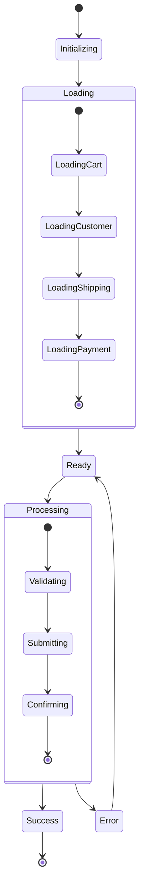
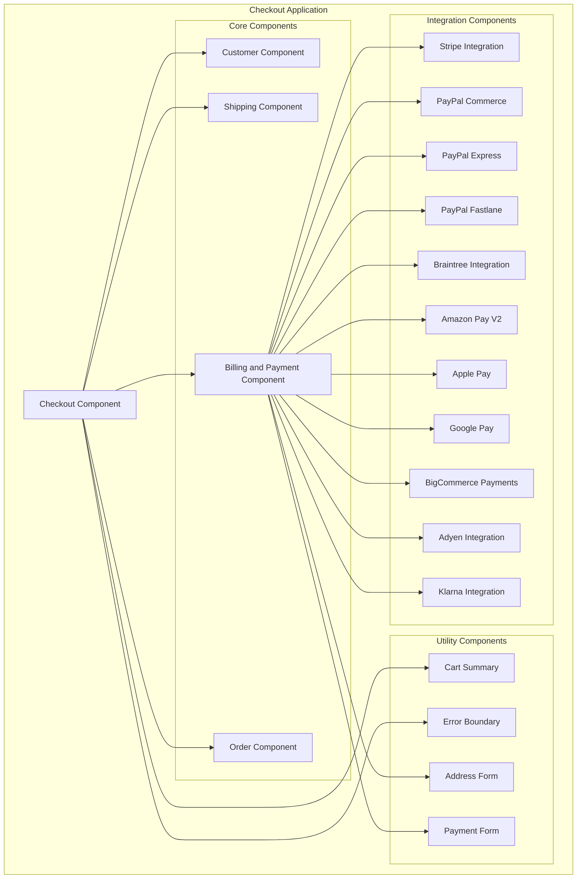
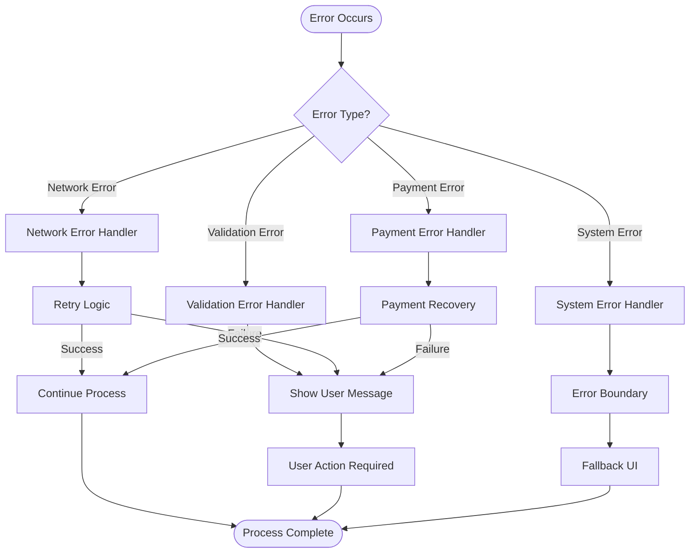
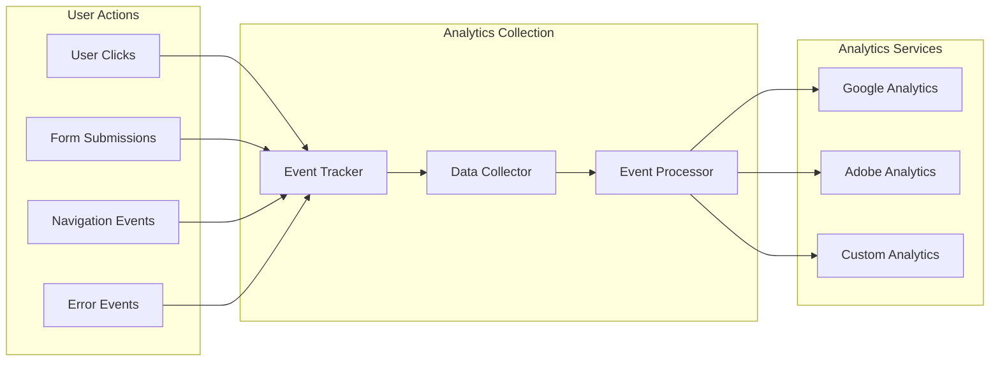
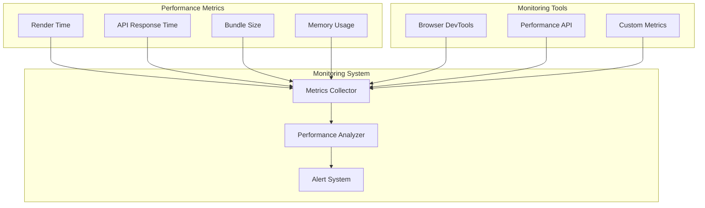

# Data Flow Diagrams - System Patterns

## Architecture Overview

**Purpose**: Documents data flow patterns, processes, and strategies used across all packages in the BigCommerce checkout system.

**Architecture**: System-level documentation of data flow patterns, processes, and data flow strategies.

## Checkout Data Flow

## Payment Data Flow

## State Management Flow

## Component Hierarchy

## Error Handling Flow

## Analytics Data Flow

## Performance Monitoring Flow

## Maintenance Notes

### Common Issues
- **Data Flow Bottlenecks**: Identifying and resolving data flow bottlenecks
- **State Synchronization**: Ensuring state consistency across components
- **Performance Issues**: Optimizing data flow performance
- **Error Propagation**: Managing error propagation through data flow

### Future Considerations
- **New Data Sources**: Adding new data sources to the flow
- **Enhanced Monitoring**: Improved data flow monitoring
- **Performance Optimization**: Continued data flow optimization
- **Best Practices**: Enhanced data flow best practices
