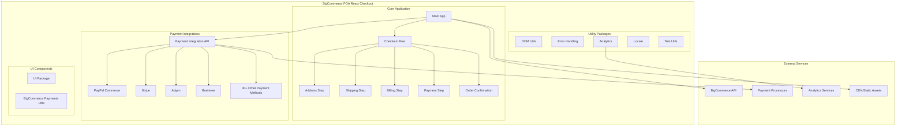
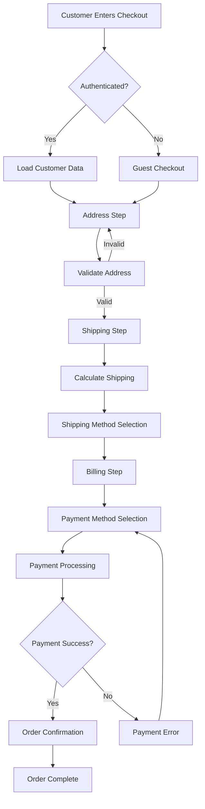
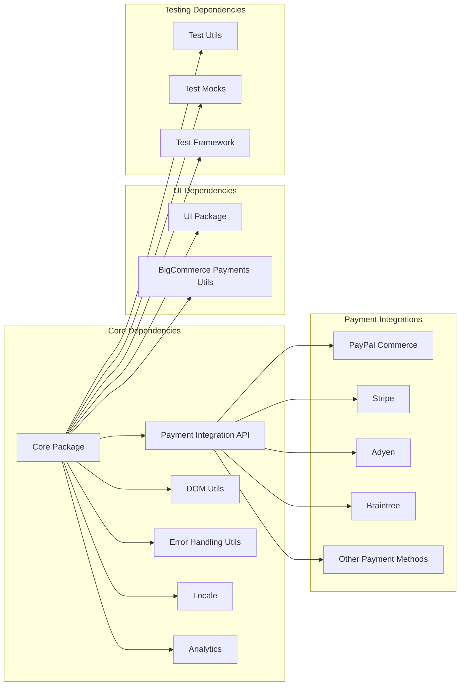
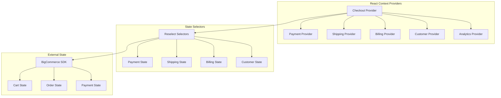
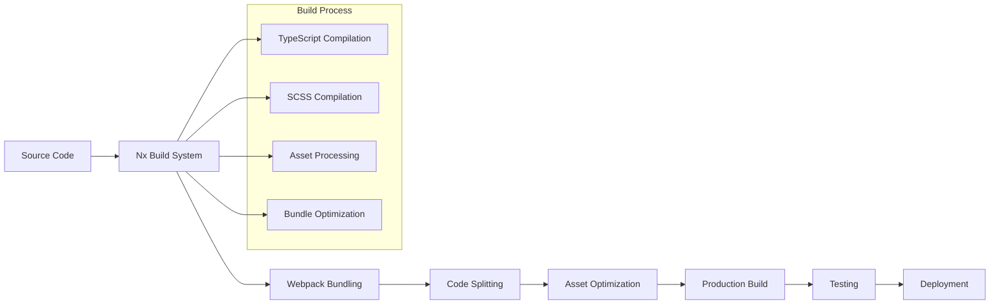
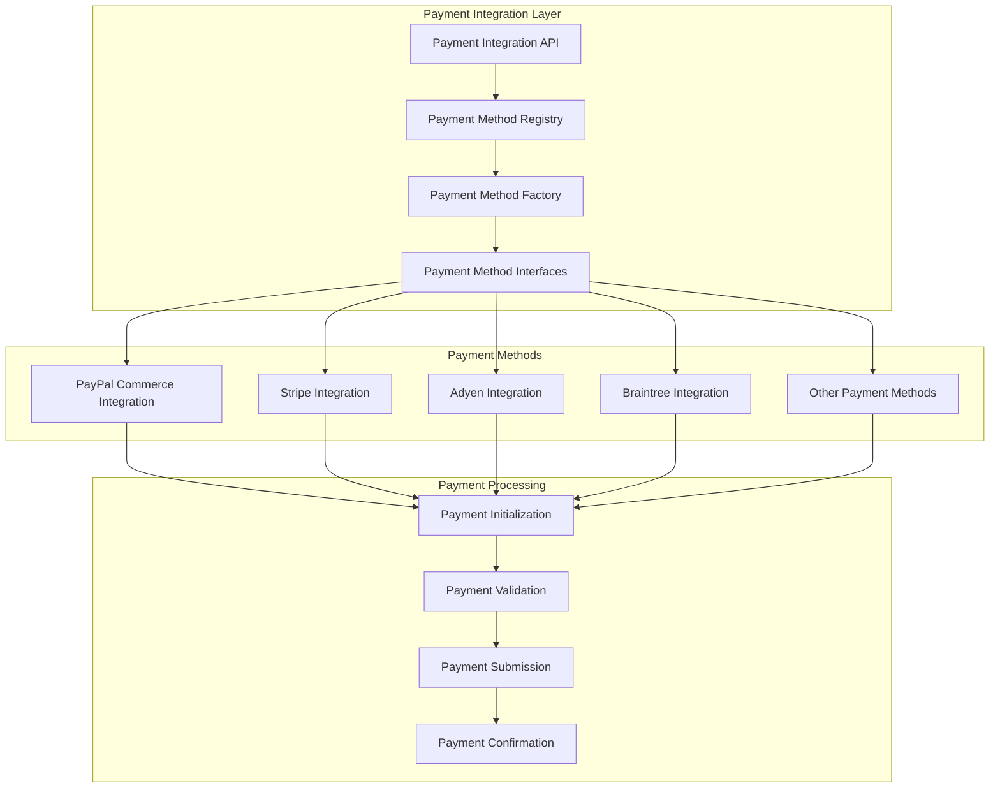
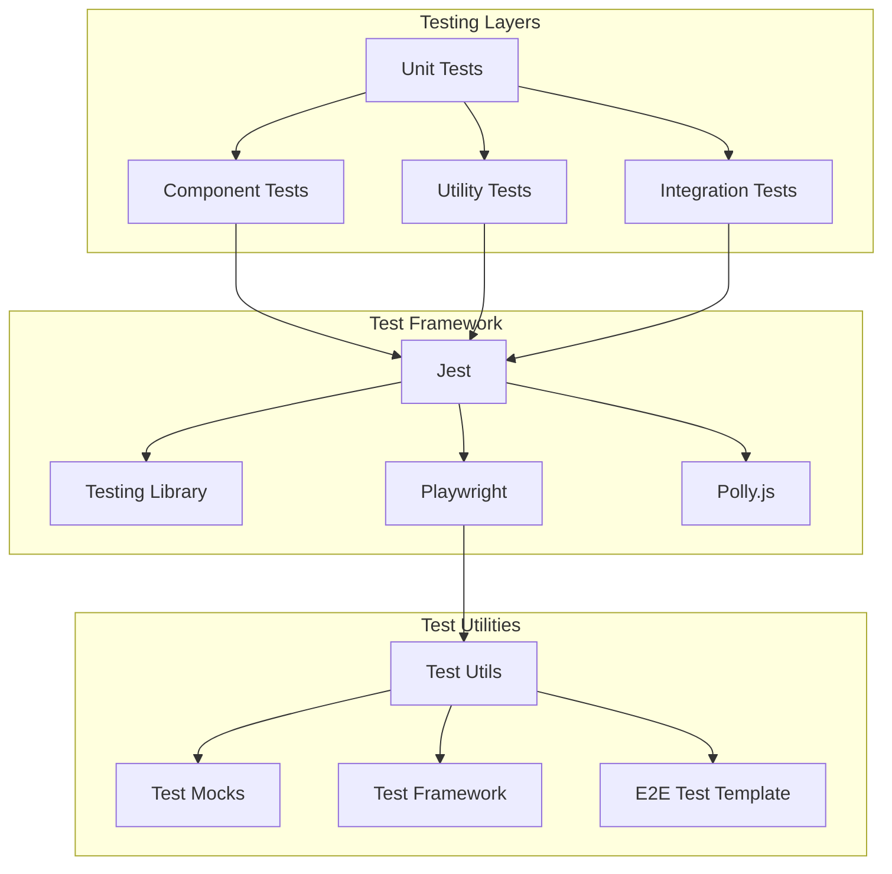
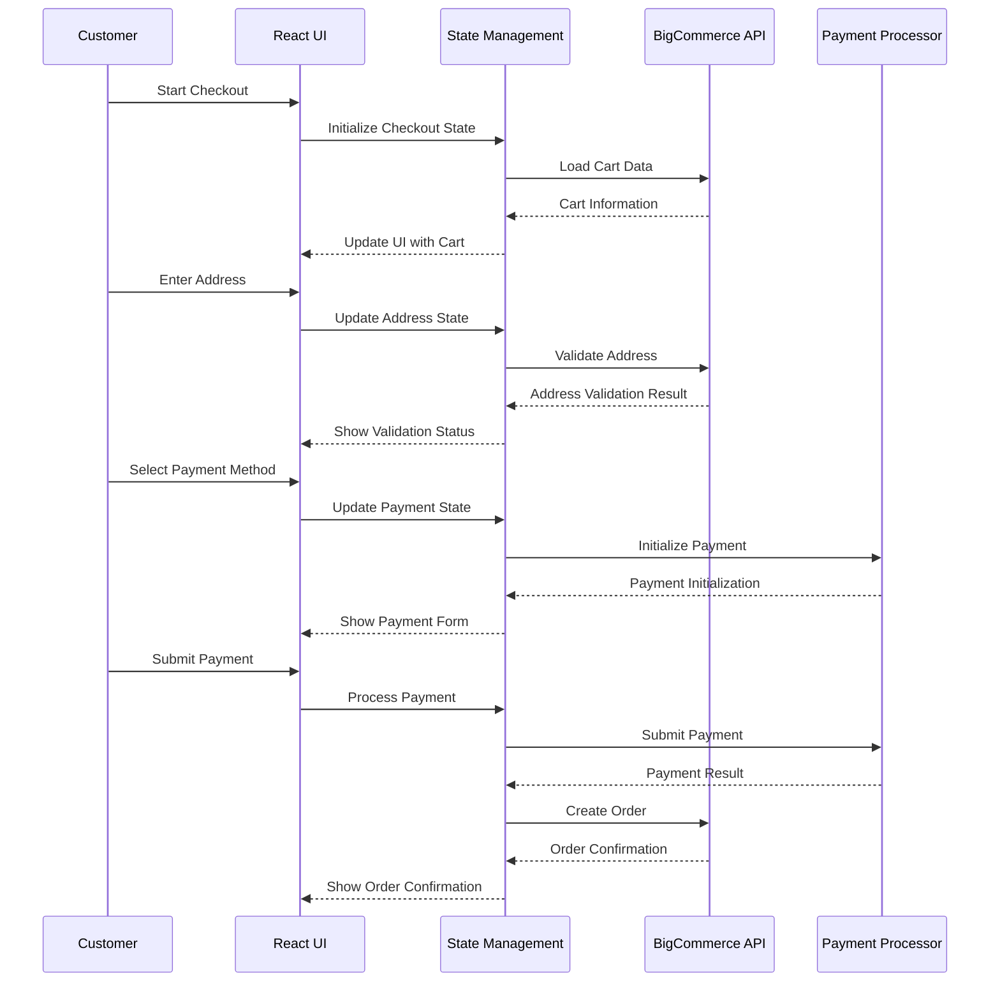
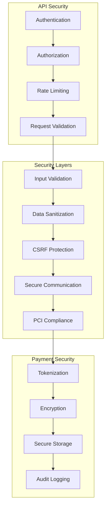

# BigCommerce POA React Checkout - Architecture Diagrams

## System Architecture Overview

## Checkout Flow Architecture

## Package Dependencies

## State Management Architecture

## Build and Deployment Pipeline

## Payment Integration Architecture

## Testing Architecture

## Data Flow Architecture

## Security Architecture

These diagrams provide a comprehensive view of the BigCommerce POA React Checkout architecture, showing the relationships between components, data flow, and system design patterns used throughout the application.

