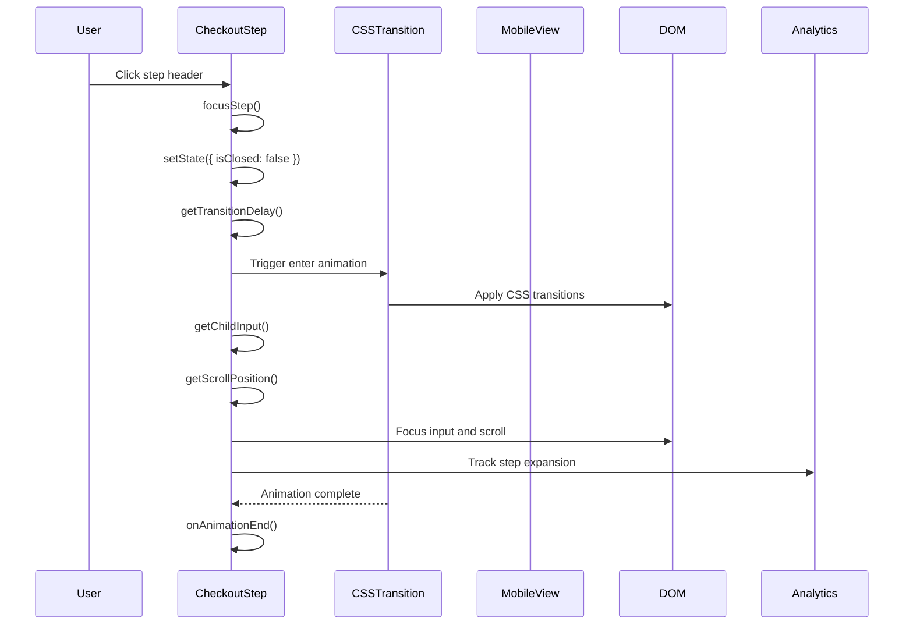

# Animation State Management - Implementation Analysis

## Core Architecture

The checkout system implements sophisticated animation state management that handles CSS transitions, focus management, scroll positioning, and responsive design. The animation system ensures smooth user interactions while maintaining performance and accessibility.

## Animation Flow Overview



## Animation State Management

### State Structure

```typescript
export interface CheckoutStepState {
    isClosed: boolean;  // Controls animation states and content visibility
}

export default class CheckoutStep extends Component<CheckoutStepProps, CheckoutStepState> {
    state = {
        isClosed: true,
    };

    private containerRef = createRef<HTMLLIElement>();
    private contentRef = createRef<HTMLDivElement>();
    private timeoutRef?: number;
    private timeoutDelay?: number;
}
```

**State Strategy:**
- **isClosed**: Controls animation states and content visibility
- **Refs**: DOM references for focus management and positioning
- **Timeouts**: Animation timing and focus delays
- **Delay Caching**: Caches transition delays for performance

### Animation Lifecycle

#### Component Mounting

```typescript
componentDidMount(): void {
    const { isActive } = this.props;

    if (isActive) {
        this.focusStep();
    }
}
```

**Mount Strategy:**
- **Initial State**: Sets up initial animation state
- **Active Check**: Checks if step should be active on mount
- **Focus Management**: Handles initial focus if active
- **Animation Setup**: Prepares animation system

#### Component Updates

```typescript
componentDidUpdate(prevProps: Readonly<CheckoutStepProps>): void {
    const { isActive } = this.props;

    if (isActive && isActive !== prevProps.isActive) {
        this.focusStep();
    }
}
```

**Update Strategy:**
- **State Comparison**: Compares current and previous props
- **Active Detection**: Detects when step becomes active
- **Focus Trigger**: Triggers focus when step activates
- **Animation Trigger**: Starts animation sequence

#### Component Unmounting

```typescript
componentWillUnmount(): void {
    if (this.timeoutRef) {
        window.clearTimeout(this.timeoutRef);
        this.timeoutRef = undefined;
    }
}
```

**Unmount Strategy:**
- **Timeout Cleanup**: Clears pending timeouts
- **Memory Management**: Prevents memory leaks
- **Animation Cleanup**: Cleans up animation resources
- **State Reset**: Resets animation state

### Focus Management Animation

#### Focus Step Implementation

```typescript
private focusStep(): void {
    const delay = isMobileView() ? 0 : this.getTransitionDelay();

    this.setState({ isClosed: false });

    this.timeoutRef = window.setTimeout(() => {
        const input = this.getChildInput();
        const position = this.getScrollPosition();
        const { type, onExpanded = noop } = this.props;

        if (input) {
            input.focus();
        }

        if (position !== undefined && !isNaN(position)) {
            window.scrollTo(0, position);
        }

        onExpanded(type);

        this.timeoutRef = undefined;
    }, delay);
}
```

**Focus Strategy:**
- **Mobile Optimization**: No delay on mobile devices
- **State Update**: Updates closed state to trigger animation
- **Input Focus**: Focuses first input element
- **Scroll Positioning**: Positions step optimally in viewport
- **Expansion Callback**: Notifies parent of step expansion

#### Input Element Detection

```typescript
private getChildInput(): HTMLElement | undefined {
    const container = this.containerRef.current;

    if (!container) {
        return;
    }

    const input = container.querySelector<HTMLElement>('input, select, textarea');

    return input || undefined;
}
```

**Input Detection Strategy:**
- **Query Selector**: Finds first input, select, or textarea
- **Type Safety**: Proper TypeScript typing
- **Null Handling**: Graceful handling of missing elements
- **Performance**: Efficient element selection

#### Scroll Position Calculation

```typescript
private getScrollPosition(): number | undefined {
    const container = this.getParentContainer();
    const { isComplete } = this.props;

    if (!container || window !== window.top) {
        return;
    }

    const topOffset = isComplete ? 0 : window.innerHeight / 5;
    const containerOffset =
        container.getBoundingClientRect().top + (window.scrollY || window.pageYOffset);

    return containerOffset - topOffset;
}
```

**Scroll Strategy:**
- **Parent Container**: Finds appropriate container for positioning
- **Completion State**: Different offset for complete vs incomplete steps
- **Window Context**: Only works in top-level window
- **Offset Calculation**: Positions step optimally in viewport

### CSS Transition Integration

#### CSSTransition Component

```typescript
private renderContent(): ReactNode {
    const { children, isActive, isBusy } = this.props;

    return (
        <MobileView>
            {(matched) => (
                <CSSTransition
                    addEndListener={this.handleTransitionEnd}
                    classNames="checkout-view-content"
                    enter={!matched}
                    exit={!matched}
                    in={isActive}
                    mountOnEnter
                    onExited={ this.onAnimationEnd }
                    timeout={ {} }
                    unmountOnExit
                >
                    <div
                        aria-busy={isBusy}
                        className="checkout-view-content"
                        ref={this.contentRef}
                    >
                        {isActive ? children : null}
                    </div>
                </CSSTransition>
            )}
        </MobileView>
    );
}
```

**Transition Strategy:**
- **Mobile Detection**: Different behavior for mobile vs desktop
- **CSS Transitions**: Smooth enter/exit animations
- **Conditional Rendering**: Only renders children when active
- **Accessibility**: ARIA busy state for loading indication
- **Performance**: Efficient animation handling

#### Transition End Handling

```typescript
private handleTransitionEnd: (node: HTMLElement, done: () => void) => void = (node, done) => {
    node.addEventListener('transitionend', ({ target }) => {
        if (target === node) {
            done();
        }
    });
};
```

**Transition End Strategy:**
- **Event Listener**: Listens for transitionend events
- **Target Validation**: Ensures event is from correct element
- **Callback Execution**: Calls done callback when transition completes
- **Performance**: Efficient event handling

#### Animation End Handling

```typescript
private onAnimationEnd = (): void => {
    const { isActive } = this.props;

    if (!isActive) {
        this.setState({ isClosed: true });
    }
}
```

**Animation End Strategy:**
- **State Update**: Updates closed state when animation ends
- **Active Check**: Only closes if step is not active
- **State Consistency**: Maintains proper state after animations
- **Performance**: Efficient state updates

### Transition Delay Management

#### Delay Calculation

```typescript
private getTransitionDelay(): number {
    if (this.timeoutDelay !== undefined) {
        return this.timeoutDelay;
    }

    // Cache the result to avoid unnecessary reflow
    this.timeoutDelay =
        parseFloat(
            this.contentRef.current
                ? getComputedStyle(this.contentRef.current).transitionDuration
                : '0s',
        ) * 1000;

    return this.timeoutDelay;
}
```

**Delay Strategy:**
- **Caching**: Caches calculated delay to avoid reflow
- **CSS Parsing**: Reads transition duration from computed styles
- **Millisecond Conversion**: Converts seconds to milliseconds
- **Fallback**: Uses 0s if no element available
- **Performance**: Avoids unnecessary DOM queries

#### Delay Usage

```typescript
private focusStep(): void {
    const delay = isMobileView() ? 0 : this.getTransitionDelay();

    this.setState({ isClosed: false });

    this.timeoutRef = window.setTimeout(() => {
        // Focus and scroll logic
    }, delay);
}
```

**Delay Usage Strategy:**
- **Mobile Optimization**: No delay on mobile devices
- **Animation Sync**: Syncs focus with animation timing
- **Smooth Experience**: Ensures smooth user experience
- **Performance**: Optimizes timing for different devices

### Responsive Animation

#### Mobile View Detection

```typescript
<MobileView>
    {(matched) => (
        <CSSTransition
            addEndListener={this.handleTransitionEnd}
            classNames="checkout-view-content"
            enter={!matched}
            exit={!matched}
            in={isActive}
            mountOnEnter
            onExited={ this.onAnimationEnd }
            timeout={ {} }
            unmountOnExit
        >
            {/* Content */}
        </CSSTransition>
    )}
</MobileView>
```

**Responsive Strategy:**
- **Mobile Detection**: Detects mobile vs desktop
- **Animation Control**: Disables animations on mobile
- **Performance**: Optimizes for mobile devices
- **User Experience**: Provides appropriate experience

#### Mobile Optimization

```typescript
private focusStep(): void {
    const delay = isMobileView() ? 0 : this.getTransitionDelay();
    // ... rest of implementation
}
```

**Mobile Optimization Strategy:**
- **No Delays**: No animation delays on mobile
- **Immediate Focus**: Immediate focus on mobile
- **Touch Optimization**: Optimized for touch interactions
- **Performance**: Better performance on mobile devices

### Animation Performance

#### Caching Strategy

```typescript
private getTransitionDelay(): number {
    if (this.timeoutDelay !== undefined) {
        return this.timeoutDelay;
    }

    // Cache the result to avoid unnecessary reflow
    this.timeoutDelay = parseFloat(
        this.contentRef.current
            ? getComputedStyle(this.contentRef.current).transitionDuration
            : '0s',
    ) * 1000;

    return this.timeoutDelay;
}
```

**Caching Strategy:**
- **Delay Caching**: Caches transition delays
- **Reflow Avoidance**: Avoids unnecessary reflows
- **Performance**: Optimizes animation performance
- **Memory Management**: Efficient memory usage

#### Timeout Management

```typescript
componentWillUnmount(): void {
    if (this.timeoutRef) {
        window.clearTimeout(this.timeoutRef);
        this.timeoutRef = undefined;
    }
}
```

**Timeout Strategy:**
- **Cleanup**: Cleans up timeouts on unmount
- **Memory Leaks**: Prevents memory leaks
- **Performance**: Optimizes performance
- **State Management**: Maintains clean state

### Animation Error Handling

#### Error Recovery

```typescript
private focusStep(): void {
    try {
        const delay = isMobileView() ? 0 : this.getTransitionDelay();
        // ... focus logic
    } catch (error) {
        // Handle animation errors
        console.error('Animation error:', error);
        // Fallback to immediate focus
        this.setState({ isClosed: false });
    }
}
```

**Error Handling Strategy:**
- **Try-Catch**: Wraps animation logic in try-catch
- **Error Logging**: Logs animation errors
- **Fallback**: Provides fallback behavior
- **User Experience**: Maintains user experience

#### State Recovery

```typescript
private onAnimationEnd = (): void => {
    try {
        const { isActive } = this.props;

        if (!isActive) {
            this.setState({ isClosed: true });
        }
    } catch (error) {
        // Handle state recovery errors
        console.error('State recovery error:', error);
    }
}
```

**State Recovery Strategy:**
- **Error Handling**: Handles state recovery errors
- **State Consistency**: Maintains state consistency
- **Fallback**: Provides fallback state
- **User Experience**: Ensures smooth user experience

### Animation Accessibility

#### ARIA Attributes

```typescript
<div
    aria-busy={isBusy}
    className="checkout-view-content"
    ref={this.contentRef}
>
    {isActive ? children : null}
</div>
```

**Accessibility Strategy:**
- **ARIA Busy**: Indicates loading state
- **Screen Reader Support**: Supports screen readers
- **Keyboard Navigation**: Maintains keyboard navigation
- **Focus Management**: Proper focus management

#### Focus Management

```typescript
private focusStep(): void {
    // ... animation logic
    
    if (input) {
        input.focus();
    }
    
    // ... rest of logic
}
```

**Focus Strategy:**
- **Input Focus**: Focuses first input element
- **Keyboard Navigation**: Maintains keyboard navigation
- **Screen Reader Support**: Supports screen readers
- **Accessibility**: Ensures accessibility compliance

## Source Files

- **Main Implementation**: `packages/core/src/app/checkout/CheckoutStep.tsx`
- **Mobile View**: `packages/core/src/app/ui/responsive/MobileView.tsx`
- **CSS Transitions**: React Transition Group
