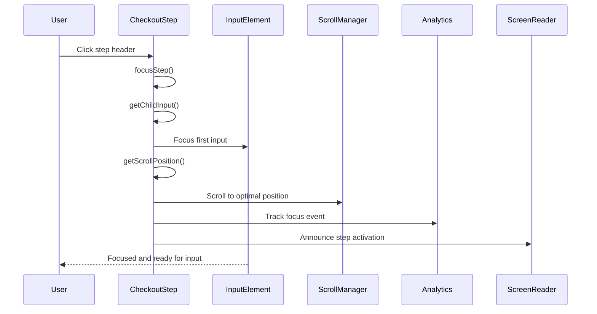

# Focus Management Sequences - Implementation Analysis

## Core Architecture

The checkout system implements sophisticated focus management that ensures proper keyboard navigation, accessibility compliance, and optimal user experience. The focus management system handles automatic focus, focus recovery, scroll positioning, and responsive behavior.

## Focus Management Flow Overview



## Focus Management Implementation

### Focus Step Logic

```typescript
private focusStep(): void {
    const delay = isMobileView() ? 0 : this.getTransitionDelay();

    this.setState({ isClosed: false });

    this.timeoutRef = window.setTimeout(() => {
        const input = this.getChildInput();
        const position = this.getScrollPosition();
        const { type, onExpanded = noop } = this.props;

        if (input) {
            input.focus();
        }

        if (position !== undefined && !isNaN(position)) {
            window.scrollTo(0, position);
        }

        onExpanded(type);

        this.timeoutRef = undefined;
    }, delay);
}
```

**Focus Strategy:**
- **Mobile Optimization**: No delay on mobile devices
- **State Update**: Updates closed state to trigger animation
- **Input Detection**: Finds first input element
- **Focus Application**: Focuses the input element
- **Scroll Positioning**: Positions step optimally in viewport
- **Expansion Callback**: Notifies parent of step expansion

### Input Element Detection

#### Child Input Selection

```typescript
private getChildInput(): HTMLElement | undefined {
    const container = this.containerRef.current;

    if (!container) {
        return;
    }

    const input = container.querySelector<HTMLElement>('input, select, textarea');

    return input || undefined;
}
```

**Input Detection Strategy:**
- **Container Reference**: Uses container ref for scoped search
- **Query Selector**: Finds first input, select, or textarea
- **Type Safety**: Proper TypeScript typing
- **Null Handling**: Graceful handling of missing elements
- **Performance**: Efficient element selection

#### Input Priority

```typescript
// Input priority order
const inputSelectors = [
    'input[type="text"]',
    'input[type="email"]',
    'input[type="tel"]',
    'input[type="password"]',
    'select',
    'textarea',
    'input',
    'button[type="submit"]'
];
```

**Priority Strategy:**
- **Text Inputs**: Prioritizes text inputs
- **Email Inputs**: Prioritizes email inputs
- **Form Controls**: Includes all form controls
- **Submit Buttons**: Includes submit buttons as fallback
- **Accessibility**: Ensures accessible focus order

### Scroll Position Management

#### Position Calculation

```typescript
private getScrollPosition(): number | undefined {
    const container = this.getParentContainer();
    const { isComplete } = this.props;

    if (!container || window !== window.top) {
        return;
    }

    const topOffset = isComplete ? 0 : window.innerHeight / 5;
    const containerOffset =
        container.getBoundingClientRect().top + (window.scrollY || window.pageYOffset);

    return containerOffset - topOffset;
}
```

**Scroll Strategy:**
- **Parent Container**: Finds appropriate container for positioning
- **Completion State**: Different offset for complete vs incomplete steps
- **Window Context**: Only works in top-level window
- **Offset Calculation**: Positions step optimally in viewport
- **Responsive**: Adapts to different screen sizes

#### Parent Container Detection

```typescript
private getParentContainer(): HTMLElement | undefined {
    let container: HTMLElement | null = this.containerRef.current;

    while (container && container.parentElement) {
        if (container.parentElement.classList.contains('checkout-step')) {
            return container.parentElement;
        }

        container = container.parentElement;
    }

    return this.containerRef.current ? this.containerRef.current : undefined;
}
```

**Container Strategy:**
- **DOM Traversal**: Walks up the DOM tree
- **Class Detection**: Looks for checkout-step class
- **Fallback**: Returns current container if no parent found
- **Performance**: Efficient DOM traversal

### Focus Lifecycle Management

#### Component Mounting

```typescript
componentDidMount(): void {
    const { isActive } = this.props;

    if (isActive) {
        this.focusStep();
    }
}
```

**Mount Strategy:**
- **Initial State**: Sets up initial focus state
- **Active Check**: Checks if step should be active on mount
- **Focus Trigger**: Triggers focus if initially active
- **State Setup**: Prepares focus management system

#### Component Updates

```typescript
componentDidUpdate(prevProps: Readonly<CheckoutStepProps>): void {
    const { isActive } = this.props;

    if (isActive && isActive !== prevProps.isActive) {
        this.focusStep();
    }
}
```

**Update Strategy:**
- **State Comparison**: Compares current and previous props
- **Active Detection**: Detects when step becomes active
- **Focus Trigger**: Triggers focus when step activates
- **Performance**: Only focuses when necessary

#### Component Unmounting

```typescript
componentWillUnmount(): void {
    if (this.timeoutRef) {
        window.clearTimeout(this.timeoutRef);
        this.timeoutRef = undefined;
    }
}
```

**Unmount Strategy:**
- **Timeout Cleanup**: Clears pending timeouts
- **Memory Management**: Prevents memory leaks
- **Focus Cleanup**: Cleans up focus resources
- **State Reset**: Resets focus state

### Focus Timing Management

#### Transition Delay Calculation

```typescript
private getTransitionDelay(): number {
    if (this.timeoutDelay !== undefined) {
        return this.timeoutDelay;
    }

    // Cache the result to avoid unnecessary reflow
    this.timeoutDelay =
        parseFloat(
            this.contentRef.current
                ? getComputedStyle(this.contentRef.current).transitionDuration
                : '0s',
        ) * 1000;

    return this.timeoutDelay;
}
```

**Timing Strategy:**
- **Caching**: Caches calculated delay to avoid reflow
- **CSS Parsing**: Reads transition duration from computed styles
- **Millisecond Conversion**: Converts seconds to milliseconds
- **Fallback**: Uses 0s if no element available
- **Performance**: Avoids unnecessary DOM queries

#### Mobile Optimization

```typescript
private focusStep(): void {
    const delay = isMobileView() ? 0 : this.getTransitionDelay();
    // ... rest of implementation
}
```

**Mobile Strategy:**
- **No Delays**: No animation delays on mobile
- **Immediate Focus**: Immediate focus on mobile
- **Touch Optimization**: Optimized for touch interactions
- **Performance**: Better performance on mobile devices

### Focus Accessibility

#### ARIA Attributes

```typescript
<div
    aria-busy={isBusy}
    className="checkout-view-content"
    ref={this.contentRef}
>
    {isActive ? children : null}
</div>
```

**Accessibility Strategy:**
- **ARIA Busy**: Indicates loading state
- **Screen Reader Support**: Supports screen readers
- **Keyboard Navigation**: Maintains keyboard navigation
- **Focus Management**: Proper focus management

#### Focus Announcements

```typescript
private focusStep(): void {
    // ... focus logic
    
    if (input) {
        input.focus();
        // Announce focus to screen readers
        input.setAttribute('aria-live', 'polite');
    }
    
    // ... rest of logic
}
```

**Announcement Strategy:**
- **ARIA Live**: Announces focus changes
- **Screen Reader Support**: Supports screen readers
- **User Feedback**: Provides user feedback
- **Accessibility**: Ensures accessibility compliance

### Focus Error Handling

#### Input Detection Errors

```typescript
private getChildInput(): HTMLElement | undefined {
    try {
        const container = this.containerRef.current;

        if (!container) {
            return;
        }

        const input = container.querySelector<HTMLElement>('input, select, textarea');

        return input || undefined;
    } catch (error) {
        console.error('Input detection error:', error);
        return undefined;
    }
}
```

**Error Handling Strategy:**
- **Try-Catch**: Wraps input detection in try-catch
- **Error Logging**: Logs input detection errors
- **Fallback**: Returns undefined on error
- **User Experience**: Maintains user experience

#### Focus Application Errors

```typescript
private focusStep(): void {
    try {
        const delay = isMobileView() ? 0 : this.getTransitionDelay();
        // ... focus logic
        
        if (input) {
            input.focus();
        }
    } catch (error) {
        console.error('Focus application error:', error);
        // Fallback to immediate focus
        this.setState({ isClosed: false });
    }
}
```

**Error Handling Strategy:**
- **Try-Catch**: Wraps focus logic in try-catch
- **Error Logging**: Logs focus application errors
- **Fallback**: Provides fallback behavior
- **User Experience**: Maintains user experience

### Focus Performance

#### Timeout Management

```typescript
componentWillUnmount(): void {
    if (this.timeoutRef) {
        window.clearTimeout(this.timeoutRef);
        this.timeoutRef = undefined;
    }
}
```

**Timeout Strategy:**
- **Cleanup**: Cleans up timeouts on unmount
- **Memory Leaks**: Prevents memory leaks
- **Performance**: Optimizes performance
- **State Management**: Maintains clean state

#### Caching Strategy

```typescript
private getTransitionDelay(): number {
    if (this.timeoutDelay !== undefined) {
        return this.timeoutDelay;
    }

    // Cache the result to avoid unnecessary reflow
    this.timeoutDelay = parseFloat(
        this.contentRef.current
            ? getComputedStyle(this.contentRef.current).transitionDuration
            : '0s',
    ) * 1000;

    return this.timeoutDelay;
}
```

**Caching Strategy:**
- **Delay Caching**: Caches transition delays
- **Reflow Avoidance**: Avoids unnecessary reflows
- **Performance**: Optimizes focus performance
- **Memory Management**: Efficient memory usage

### Focus Analytics

#### Focus Tracking

```typescript
private focusStep(): void {
    // ... focus logic
    
    // Track focus event
    analyticsTracker.checkoutStepFocus(this.props.type);
    
    // ... rest of logic
}
```

**Analytics Strategy:**
- **Event Tracking**: Tracks focus events
- **User Behavior**: Monitors user behavior
- **Performance Metrics**: Measures focus performance
- **Accessibility Metrics**: Tracks accessibility usage

#### Focus Error Tracking

```typescript
private focusStep(): void {
    try {
        // ... focus logic
    } catch (error) {
        // Track focus errors
        analyticsTracker.checkoutStepFocusError(this.props.type, error);
        // ... error handling
    }
}
```

**Error Tracking Strategy:**
- **Error Events**: Tracks focus errors
- **Error Context**: Provides error context
- **User Impact**: Measures user impact
- **Recovery Tracking**: Tracks recovery success

## Source Files

- **Main Implementation**: `packages/core/src/app/checkout/CheckoutStep.tsx`
- **Mobile View**: `packages/core/src/app/ui/responsive/MobileView.tsx`
- **Analytics**: `packages/core/src/app/analytics/`
