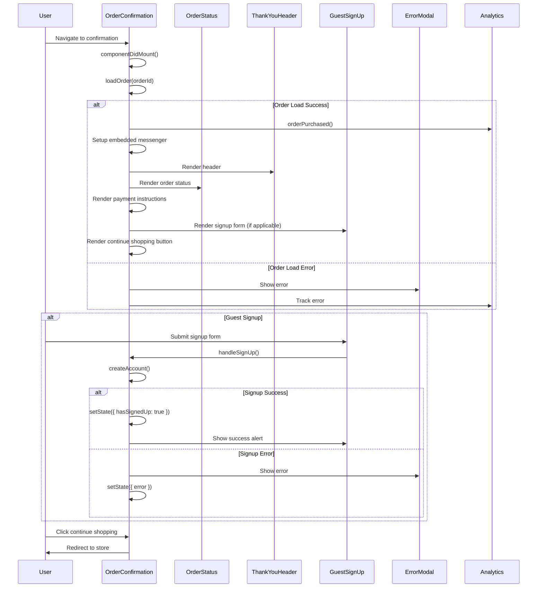

# Order Confirmation Flow - Complete Implementation Analysis

## Overview

The order confirmation flow is the final step in the checkout process, handling order display, payment instructions, guest signup, and error recovery. This flow involves multiple components working together to provide a complete post-purchase experience.

## Flow Sequence



## Detailed Implementation Flow

### 1. Initialization Phase

```typescript
componentDidMount(): void {
    const {
        containerId,
        createEmbeddedMessenger,
        embeddedStylesheet,
        loadOrder,
        orderId,
        analyticsTracker
    } = this.props;

    loadOrder(orderId)
        .then(({ data }) => {
            const { links: { siteLink = '' } = {} } = data.getConfig() || {};
            const messenger = createEmbeddedMessenger({ parentOrigin: siteLink });

            this.embeddedMessenger = messenger;

            messenger.receiveStyles((styles) => embeddedStylesheet.append(styles));
            messenger.postFrameLoaded({ contentId: containerId });

            analyticsTracker.orderPurchased();
        })
        .catch(this.handleUnhandledError);
}
```

**Initialization Strategy:**
- Loads order data asynchronously
- Sets up embedded checkout communication
- Handles style injection from parent window
- Tracks purchase completion analytics
- Provides error handling for failed loads

### 2. Order Loading and Validation

```typescript
render(): ReactNode {
    const { order, config, isLoadingOrder } = this.props;

    if (!order || !config || isLoadingOrder()) {
        return <LoadingSpinner isLoading={true} />;
    }

    const paymentInstructions = getPaymentInstructions(order);
    const {
        storeProfile: { storePhoneNumber },
        shopperConfig,
        links: { siteLink },
    } = config;
```

**Loading Strategy:**
- Shows loading spinner while order loads
- Validates order and config data
- Extracts payment instructions from order
- Prepares store configuration data

### 3. Order Status Display

```typescript
<OrderStatus
    config={config}
    order={order}
    userEmail={order.billingAddress.email || ''}
    supportPhoneNumber={storePhoneNumber}
/>
```

**Order Status Strategy:**
- Displays order number and confirmation details
- Shows customer email and support information
- Renders order-specific messaging
- Provides contact information

### 4. Payment Instructions Rendering

```typescript
{paymentInstructions && (
    <OrderConfirmationSection>
        <div
            dangerouslySetInnerHTML={{
                __html: DOMPurify.sanitize(paymentInstructions),
            }}
            data-test="payment-instructions"
        />
    </OrderConfirmationSection>
)}
```

**Payment Instructions Strategy:**
- Conditionally renders based on payment method
- Sanitizes HTML content for security
- Uses DOMPurify to prevent XSS attacks
- Provides test ID for automation

### 5. Guest Signup Flow

```typescript
{this.renderGuestSignUp({
    shouldShowPasswordForm: order.customerCanBeCreated,
    customerCanBeCreated: !order.customerId,
    shopperConfig,
})}
```

**Guest Signup Strategy:**
- Shows signup form for guest customers
- Checks if customer can be created
- Validates customer ID existence
- Uses store configuration for requirements

### 6. Guest Signup Implementation

```typescript
private renderGuestSignUp({
    customerCanBeCreated,
    shouldShowPasswordForm,
    shopperConfig,
}: {
    customerCanBeCreated: boolean;
    shouldShowPasswordForm: boolean;
    shopperConfig: ShopperConfig;
}): ReactNode {
    const { isSigningUp, hasSignedUp } = this.state;

    return (
        <>
            {shouldShowPasswordForm && !hasSignedUp && (
                <GuestSignUpForm
                    customerCanBeCreated={customerCanBeCreated}
                    isSigningUp={isSigningUp}
                    onSignUp={this.handleSignUp}
                    passwordRequirements={getPasswordRequirementsFromConfig(shopperConfig)}
                />
            )}

            {hasSignedUp &&
                (order?.customerId ? <PasswordSavedSuccessAlert /> : <SignedUpSuccessAlert />)}
        </>
    );
}
```

**Signup Implementation Strategy:**
- Conditional rendering based on signup state
- Shows form only when needed
- Displays success alerts after signup
- Different alerts for different outcomes

### 7. Account Creation Handling

```typescript
private handleSignUp: (values: SignUpFormValues) => void = ({ password, confirmPassword }) => {
    const { createAccount, config } = this.props;

    const shopperConfig = config && config.shopperConfig;
    const passwordRequirements =
        (shopperConfig &&
            shopperConfig.passwordRequirements &&
            shopperConfig.passwordRequirements.error) ||
        '';

    this.setState({
        isSigningUp: true,
    });

    createAccount({
        password,
        confirmPassword,
    })
        .then(() => {
            this.setState({
                hasSignedUp: true,
                isSigningUp: false,
            });
        })
        .catch((error) => {
            this.setState({
                error:
                    error.status < 500
                        ? new AccountCreationRequirementsError(error, passwordRequirements)
                        : new AccountCreationFailedError(error),
                hasSignedUp: false,
                isSigningUp: false,
            });
        });
};
```

**Account Creation Strategy:**
- Validates password requirements from store config
- Handles different error types with specific error classes
- Manages loading and success states
- Provides user-friendly error messages

### 8. Error Handling and Recovery

```typescript
private handleUnhandledError: (error: Error) => void = (error) => {
    const { errorLogger } = this.props;

    this.setState({ error });
    errorLogger.log(error);

    if (this.embeddedMessenger) {
        this.embeddedMessenger.postError(error);
    }
};

private renderErrorModal(): ReactNode {
    const { error } = this.state;

    return (
        <ErrorModal
            error={error}
            onClose={this.handleErrorModalClose}
            shouldShowErrorCode={false}
        />
    );
}
```

**Error Handling Strategy:**
- Centralized error handling for all operations
- Error logging integration
- Embedded checkout error communication
- User-friendly error display
- Error state cleanup

### 9. Continue Shopping Flow

```typescript
<div className="continueButtonContainer">
    <form action={siteLink} method="get" target="_top">
        <Button type="submit" variant={ButtonVariant.Secondary}>
            <TranslatedString id="order_confirmation.continue_shopping" />
        </Button>
    </form>
</div>
```

**Continue Shopping Strategy:**
- Uses form submission for navigation
- Redirects to store homepage
- Opens in top window (not embedded)
- Localized button text

## Edge Cases and Error Scenarios

### 1. Order Loading Failures

```typescript
loadOrder(orderId)
    .then(({ data }) => {
        // Success handling
    })
    .catch(this.handleUnhandledError);
```

**Error Scenarios:**
- Network failures during order loading
- Invalid order ID
- Order not found
- Server errors

**Recovery Strategy:**
- Shows error modal with user-friendly message
- Logs error for debugging
- Communicates error to embedded checkout
- Allows user to retry or contact support

### 2. Guest Signup Failures

```typescript
createAccount({
    password,
    confirmPassword,
})
    .then(() => {
        // Success handling
    })
    .catch((error) => {
        this.setState({
            error:
                error.status < 500
                    ? new AccountCreationRequirementsError(error, passwordRequirements)
                    : new AccountCreationFailedError(error),
            hasSignedUp: false,
            isSigningUp: false,
        });
    });
```

**Error Scenarios:**
- Password requirements not met
- Account already exists
- Server validation errors
- Network failures

**Recovery Strategy:**
- Shows specific error messages
- Differentiates between client and server errors
- Allows user to retry signup
- Maintains form state

### 3. Embedded Checkout Communication Failures

```typescript
if (this.embeddedMessenger) {
    this.embeddedMessenger.postError(error);
}
```

**Error Scenarios:**
- Parent window communication failure
- Style injection failures
- Frame loaded notification failures

**Recovery Strategy:**
- Graceful degradation
- Continues to function without embedded features
- Logs communication errors
- Maintains core functionality

### 4. Payment Instructions Security

```typescript
<div
    dangerouslySetInnerHTML={{
        __html: DOMPurify.sanitize(paymentInstructions),
    }}
    data-test="payment-instructions"
/>
```

**Security Scenarios:**
- Malicious HTML in payment instructions
- XSS attack attempts
- Invalid HTML content

**Security Strategy:**
- DOMPurify sanitization
- HTML content validation
- XSS prevention
- Safe content rendering

## Performance Optimizations

### 1. Conditional Rendering

```typescript
if (!order || !config || isLoadingOrder()) {
    return <LoadingSpinner isLoading={true} />;
}
```

**Optimization Strategy:**
- Only renders content when order is loaded
- Prevents unnecessary rendering
- Shows loading state immediately
- Reduces initial render time

### 2. Error Boundary Implementation

```typescript
private handleUnhandledError: (error: Error) => void = (error) => {
    const { errorLogger } = this.props;

    this.setState({ error });
    errorLogger.log(error);

    if (this.embeddedMessenger) {
        this.embeddedMessenger.postError(error);
    }
};
```

**Error Boundary Strategy:**
- Catches all unhandled errors
- Prevents application crashes
- Provides error recovery
- Maintains user experience

### 3. State Management

```typescript
interface OrderConfirmationState {
    error?: Error;
    hasSignedUp?: boolean;
    isSigningUp?: boolean;
}
```

**State Strategy:**
- Minimal state for performance
- Efficient state updates
- Proper state cleanup
- Error state management

## Integration Points

The flow integrates with:
- **BigCommerce SDK**: Order loading and configuration
- **Embedded Checkout**: Messaging and styling
- **Analytics**: Purchase tracking
- **Error Logging**: Centralized error handling
- **Guest Signup**: Account creation flow
- **Payment Instructions**: Method-specific content

## Source Files

- **Main Flow**: `packages/core/src/app/order/OrderConfirmation.tsx`
- **Order Status**: `packages/core/src/app/order/OrderStatus.tsx`
- **Thank You Header**: `packages/core/src/app/order/ThankYouHeader.tsx`
- **Guest Signup**: `packages/core/src/app/guestSignup/`
- **Error Modal**: `packages/core/src/app/common/error/ErrorModal.tsx`
- **Payment Instructions**: `packages/core/src/app/order/getPaymentInstructions.ts`
